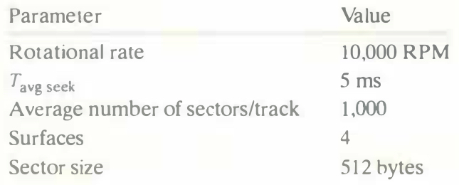

# Practice Problem 6.4 (solution page 661)
Suppose that a 1 MB file consisting of 512-byte logical blocks is stored on a disk drive with the following characteristics:

For each case below, suppose that a program reads the logical blocks of the file sequentially, one after the other, and that the time to position the head over the first block is $T_{avg \ seek} + T_{avg \ rotation}$

A. Best case: Estimate the optimal time (in ms) required to read the file given the best possible mapping of logical blocks to disk sectors (i.e., sequential).

B. Random case: Estimate the time (in ms) required to read the file if blocks are mapped randomly to disk sectors.

## Solution:

- A. Best case:

    - $n$ logical blocks of 1 MB file = $\frac{1 \ MB}{512 \ byte} = \frac{2^{20}}{512} = 2048$
        - Disk file uses $10^6$ instead of $2^{20}$?

    - $T_{max \ rotation} = \frac{1}{RPM} \times \frac{60secs}{1min} \times \frac{1,000ms}{sec} = 6ms$
    
    - $T_{avg \ rotation} = \frac{1}{2} \times T_{max \ rotation} = 3ms$

    - Optimal time = $T_{avg \ seek} + T_{avg \ rotation} + \frac{2048}{1000} \times T_{max \ rotation} = 5ms + 3ms + 2.048 \times 6ms = 20.288ms$

- B. Random case:

    - $T_{transfer \ time} = \frac{1}{avg \ \# \ sectors/track} \times T_{max \ rotation} = 0.006ms$

    - Total time = $2048 \times (T_{avg \ seek} + T_{avg \ rotation} + T_{transfer \ time}) = 2048 \times (5ms + 3ms + 0.006ms) = 16385.2288ms$ 