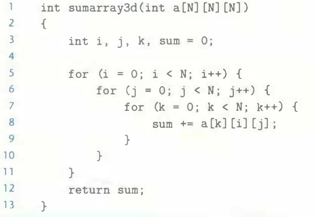

# Practice Problem 6.7 (solution page 662)
Permute the loops in the following function so that it scans the three-dimensional array `a` with a stride-1 reference pattern.



## Solution:
```
int sumarray3d(int a[N][N][N])
{
    int i, j, k, sum = O;
    
    for(k = O; i < N; k++){
        for(i = O; i < N; i++){
            for(j = O; i < N; j++){
                sum += a[k][i][j];
            }
        }
    }
    return sum ;
}
```