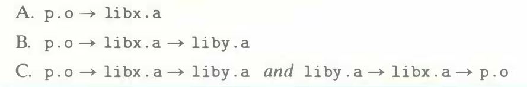

# Practice Problem 7.3 (solution page 718)
Let `a` and `b` denote object modules or static libraries in the current directory, and let `a` $\rightarrow$ `b` denote that `a` depends on `b`, in the sense that `b` defines a symbol that is referenced by `a`. For each of the following scenarios show the minimal command line (i.e., one with the least number of object file and library arguments) that will allow the static linker to resolve all symbol references.

## Solution:

- A.

    `linux> gcc p.o libx.a`

- B.

    `linux> gcc p.o libx.a liby.a`

- C.

    `linux> gcc p.o libx.a liby.a libx.a`