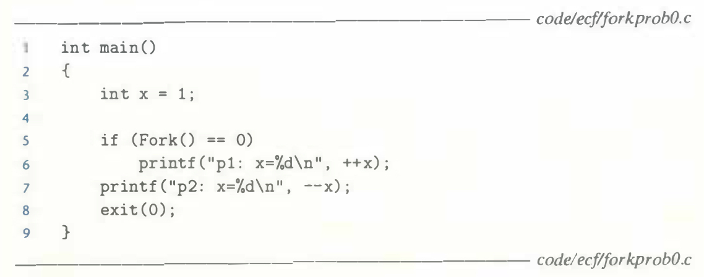
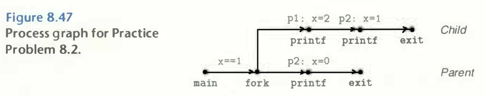

# Practice Problem 8.2 (solution page 795)
Consider the following program:



A. What is the output of the child process?

B. What is the output of the parent process?

## Solution:



A. 

```
p1: x=2
P2: x=1
```

B. 
```
P2: x=0
```