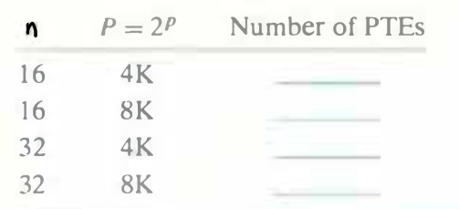

# Practice Problem 9.2 (solution page 881)
Determine the number of page table entries (PTEs) that are needed for the following combinations of virtual address size ($n$) and page size ($P$):

## Solution:

$n$|$P=2^p$|$p$|Number of PTEs
-|-|-|-
16|4K|12|16
16|8K|13|8
32|4K|12|$2^{20}=1M$
32|8K|13|$2^{19}=512K$

- Number of PTEs = $2^n / 2^p = 2^{n-p}$