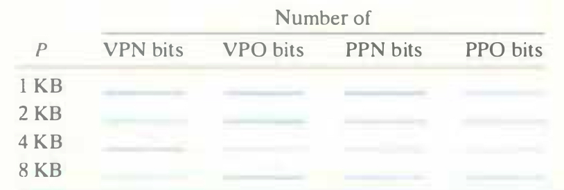

# Practice Problem 9.3 (solution page 881)
Given a 32-bit virtual address space and a 24-bit physical address, determine the number of bits in the VPN, VPO, PPN, and PPO for the following page sizes $P$:

## Solution:

$P$|VPN|VPO|PPN|PPO
-|-|-|-|-
1 KB|22|10|14|10
2 KB|21|11|13|11
4 KB|20|12|12|12
8 KB|19|13|11|13