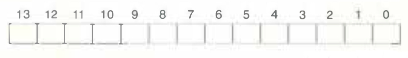
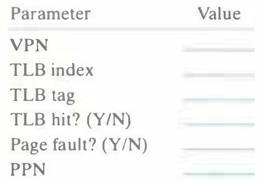
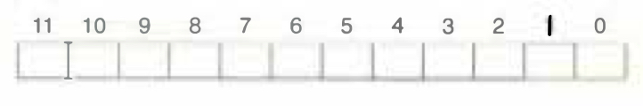
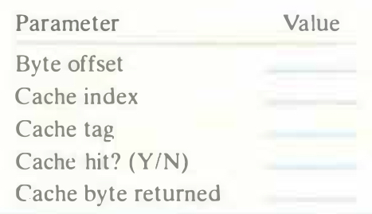

# Practice Problem 9.4 (solution page 881)
Show how the example memory system in Section 9.6.4 translates a virtual address into a physical address and accesses the cache. For the given virtual address, indicate the TLB entry accessed, physical address, and cache byte value returned. Indicate whether the TLB misses, whether a page fault occurs, and whether a cache miss occurs. If there is a cache miss, enter "—" for "Cache byte returned." If there is a page fault, enter "—" for "PPN" and leave parts C and D blank.

Virtual address: `0x03d7`

A. Virtual address format

B. Address translation

C. Physical address format

D. Physical memory reference

## Solution:
A. Virtual address format

13|12|11|10|9|8|7|6|5|4|3|2|1|0
-|-|-|-|-|-|-|-|-|-|-|-|-|-
0|0|0|0|1|1|1|1|0|1|0|1|1|1

B. Address translation

Parameter|Value
-|-
VPN|`0x0F`
TLB index|`0x3`
TLB tag|`0x03`
TLB hit? (Y/N)|Y
Page fault? (Y/N)|N
PPN|`0x0D`

C. Physical address format

11|10|9|8|7|6|5|4|3|2|1|0
-|-|-|-|-|-|-|-|-|-|-|-
0|0|1|1|0|1|0|1|0|1|1|1

D. Physical memory reference

Parameter|Value
-|-
Byte offset|`0x3`
Cache index|`0x5`
Cache tag|`0x0D`
Cache hit? (Y/N)|Y
Cache byte returned|`0x1D`