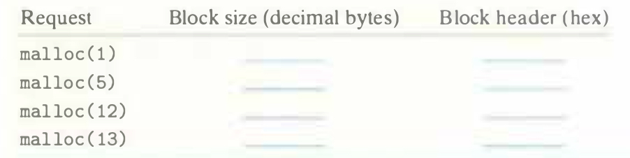

# Practice Problem 9.6 (solution page 883)
Determine the block sizes and header values that would result from the following sequence of `malloc` requests. Assumptions: (1) The allocator maintains double-word alignment and uses an implicit free list with the block format from Figure 9.35. (2) Block sizes are rounded up to the nearest multiple of 8 bytes.

## Solution:

Request|Block size(decimal bytes)|Block header(hex)
-|-|-
`malloc(1)`|8|`0x00000009`
`malloc(5)`|~~8~~ 16|~~`0x00000009`~~ `0x00000011`
`malloc(12)`|16|`0x00000011`
`malloc(13)`|~~16~~ 24|~~`0x00000011`~~ `0x00000019`

- `malloc(5)`
    - The payload is 5 bytes, the header is 4 bytes, at least the block size is 9 bytes
    - In order to satisfy double-word alignment, the block size is multiple of 8
    - Thus, the block size is 16 