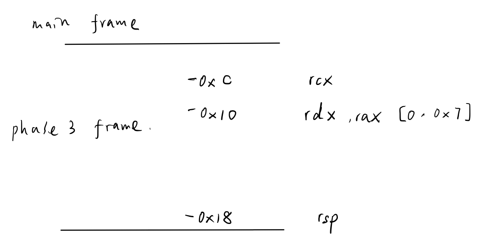

# Bomb Lab
## Table of contents
- [Introduction](#introduction)
- [Duration](#duration)
- [Solution](#solution)
    - [Phase 1](#phase-1)
    - [Phase 2](#phase-2)
    - [Phase 3](#phase-3)
    - [Phase 4](#phase-4)
    - [Phase 5](#phase-5)
    - [Phase 6](#phase-6)
    - [Secret phase](#secret-phase)

## Introduction
- A "binary bomb" is a program provided to students as an object code file
    - When run, it prompts the user to type in 6 different strings
    - If any of these is incorrect, the bomb "explodes," printing an error message and logging the event on a grading server
    - Students must "defuse" their own unique bomb by disassembling and reverse engineering the program to determine what the 6 strings should be

- The lab teaches students to understand assembly language, and also forces them to learn how to use a debugger
    - It's also great fun
    - A legendary lab among the CMU undergrads

- Here's a Linux/x86-64 binary bomb that you can try out for yourself
    - The feature that notifies the grading server has been disabled, so feel free to explode this bomb with impunity
    - If you're an instructor with a CS:APP account, then you can download the solution

## Duration
- 2025/2/4 - 

## Solution
- Generate the symbol table and store it in the file `bomb/symbol_table`

    ```
    objdump -t bomb > symbol_table
    ```

- Disassemble all of the code in the bomb and store in `bomb/disassemble`

    ```
    objdump -d bomb > disassemble
    ```

- Display the printable strings in the bomb and store in `bomb/strings`

    ```
    strings bomb > strings
    ```

### Phase 1
- Debug with `gdb`

    ```
    linux> gdb bomb

    (gdb) break phase_1
    Breakpoint 1 at 0x400ee0
    (gdb) run
    Welcome to my fiendish little bomb. You have 6 phases with
    which to blow yourself up. Have a nice day!
    sdf

    Breakpoint 1, 0x0000000000400ee0 in phase_1 ()
    (gdb) disas phase_1
    Dump of assembler code for function phase_1:
    =>  0x0000000000400ee0 <+0>:     sub    $0x8,%rsp
        0x0000000000400ee4 <+4>:     mov    $0x402400,%esi
        0x0000000000400ee9 <+9>:     call   0x401338 <strings_not_equal>
        0x0000000000400eee <+14>:    test   %eax,%eax
        0x0000000000400ef0 <+16>:    je     0x400ef7 <phase_1+23>
        0x0000000000400ef2 <+18>:    call   0x40143a <explode_bomb>
        0x0000000000400ef7 <+23>:    add    $0x8,%rsp
        0x0000000000400efb <+27>:    ret    
    End of assembler dump.

    (gdb) stepi
    0x0000000000400ee4 in phase_1 ()
    (gdb) stepi
    0x0000000000400ee9 in phase_1 ()

    (gdb) print /x $rdi
    $3 = 0x603780
    (gdb) print /x $rsi
    $4 = 0x402400
    ```

- From disassembling `phase_1`, we get that it calls `strings_not_equal` function
    - The first argument `input` is the same as `phase_1` stored at `%rdi` with the value `0x603780`

    - The second argument is assigned at `0x400ee4` instruction `mov    $0x402400,%esi` stored at `%rsi` with the value `0x402400`

    - The `strings_not_equal` function will check whether or not the two strings stored at the address `0x603780` (input) and `0x402400` respectively are equal

- Examine the string stored at `0x402400`

    ```
    (gdb) x/s 0x402400
    0x402400:       "Border relations with Canada have never been better."
    ```

- Therefore, the phase 1 string is 

    ```
    Border relations with Canada have never been better.
    ```

### Phase 2
- `phase_2` machine code from `disassemble` file

    
    - Line 361 call function `read_six_numbers`
    - First argument `%rdi` is `input`
    - Second argument `%rsi` is `%rsp`

- Function `read_six_numbers`

    - The machine code from `disassemble` file

        

    - The stack frame diagram

        
    
    - `read_six_numbers` calls function `sscanf`
        - Argument 1 `rdi`: `input`
        - Argument 2 `rsi`: `0x4025c3`

            ```
            (gdb) x/s 0x4025c3
            0x4025c3:       "%d %d %d %d %d %d"
            ```
        
        - Argument 3 `rdx`: `-0x28`
            - This is the relative address based on the `phase_2` stack frame largest address, arguments 4-8 are similar

        - Argument 4 `rcx`: `-0x24`
        - Argument 5 `r8`: `-0x20`
        - Argument 6 `r9`: `-0x1c`
        - Argument 7 `(%rsp)`: `-0x18`
        - Argument 8 `0x8(%rsp)`: `-0x14`
    
    - The `read_six_numbers` will read 6 integers of `int` type to fill the caller stack frame from `-0x28` to `-0x14`, `0x4` size each

- `phase_2` stack frame diagram after Line 361

    
    - Based on the machine code, we can get the values of 6 integers from "relative" address `-0x28` to `-0x14` must be `1`, `2`, `4`, `8`, `16`, and `32`, otherwise the bomb explodes

- Therefore, the phase 2 string is 

    ```
    1 2 4 8 16 32
    ```

### Phase 3
- Function `phase_3`
    - The machine code from `disassemble` file

        

    - The stack frame diagram

        

    - `phase_3` will first call function `sscanf`

        - Argument 1 `rdi`: `input`
        - Argument 2 `rsi`: `0x4025cf`

            ```
            (gdb) x/s 0x4025cf
            0x4025cf:       "%d %d"
            ```
        
        - Argument 3 `rdx`: `-0x10`
        - Argument 4 `rcx`: `-0xc`

    - `sscanf` will read two integers from `input` string and stored them in the stack frame `-0x10` and `-0xc`

    - Line 394, `ja` is intended for comparing two integers of `unsigned` type, therefore the integer stored at `-0x10` should be in the range of `[0, 0x7]`

    - Line 396, the memory values starting from `0x402470` are eight addresses in `phase_3`

        ```
        (gdb) x/8g 0x402470
        0x402470:       0x0000000000400f7c      0x0000000000400fb9
        0x402480:       0x0000000000400f83      0x0000000000400f8a
        0x402490:       0x0000000000400f91      0x0000000000400f98
        0x4024a0:       0x0000000000400f9f      0x0000000000400fa6
        ```
    
    - The integer stored at `-0x10` can be any value between `[0, 0x7]`, the `jmp` instruction will jump to corresponding address, and assigned one value to `%eax`

    - The value at address `-0xc` must be equal to the `%eax`

- Therefore one of the phase 3 string is 

    ```
    0 207
    ```

### Phase 4
- `phase_4`
    - The machine code

        
    
    - The stack frame

        

    - Line 455 shows the value stored at `-0x10` are in the range `[0, 0xe]`

    - Line 463 indicates the value stored at `-0xc` are `0`

- `func4`
    - The machine code

        
    
    - Arguments
        1. `rdi`: value at `-0x10` of `phase_4` stack frame, `[0, 0xe]`
        1. `rsi`: `0`
        1. `rdx`: `0xe`

    - Line 462 shows the value returned by `func4` needs to be `0`

    - If `%ecx == %edi`, the function will return with `0`

    - If `%ecx != %edi`, the function will recursively call itself either at `0x400fe9` or `0x400ffe`
        - If `0x400fe9` is called, the return value will multiply by 2 (line 434)

        - If `0x400ffe` is called, the return value will multiply by 2 and add 1 (line 441)
    
    - After testing the `rdi` value between `[0, 0xe]`, I find only the value `0x7` will directly cause `%ecx == %edi`, and the `func4` will return with `0`
        - Otherwise `0x400ffe` will be called, the return value will never be `0`
    
- Therefore the phase 4 string is 

    ```
    7 0
    ```

### Phase 5
- `phase_5`
    - The machine code

        
    
    - The stack frame

        

- Line 472-479
    1. Indicates the `input` should be 6 characters
    1. Set the stack block `-0x8`-`-0x1` to `%fs:0x28`

- Line 482-490 instruction code
    1. Extracts the `input` character one by one
    
    1. Gets the low-order 4 bits of it, and store it in the `%edx`
        - So `%edx` value range is `[0x0, 0xf]`

    1. Gets the byte from `0x4024b0(%rdx)` and store it to the `%ecx` and `-0x10 + %rax`
        - The string store at `0x4024b0`

            ```
            (gdb) x/s 0x4024b0
            0x4024b0 <array.3449>:  "maduiersnfotvbylSo you think you can stop the bomb with ctrl-c, do you?"
            ```

    1. The initial value of `%rax` is 0 (line 500), add `%rax` by 1, repeat the code block until it reaches 6

- Line 491-495
    1. Set the `-0xa` value to 0 as the null terminating character
    1. Compare the string at `0x40245e` with string at `-0x10`

        ```
        (gdb) x/s 0x40245e
        0x40245e:       "flyers"
        ```

- Based on the string at `0x4024b0` and `0x40245e`, we can get the `input` character 4 lower-bit values are

    ```
    maduiersnfotvbyl
    0123456789012345

    `f`: 0x9
    `l`: 0xf
    `y`: 0xe
    `e`: 0x5
    `r`: 0x6
    `s`: 0x7
    ```

- Based on the ascii table we get one of the phase 5 strings is
    ```
    9On5FW
    ```

### Phase 6
- `phase_6`
    - Machine code

        [`phase_6` machine code](./bomb/phase_6)

    - Stack frame

        

- The instructions
    - From the beginning to `0x401153`:
        - Indicate #0-5 are distinct and the range of them is `[1, 6]`

        ```
        (gdb) x/6wx $rsp
        0x7fffffffde00: 0x00000006      0x00000001      0x00000002      0x00000005
        0x7fffffffde10: 0x00000004      0x00000003
        ```

    - Up to `0x40116f`: 
        - #0-5 are subtracted by 7

        ```
        (gdb) x/6wx $rsp
        0x7fffffffde00: 0x00000001      0x00000006      0x00000005      0x00000002
        0x7fffffffde10: 0x00000003      0x00000004
        ```

    - Up to `0x4011ab`
        - The stack `-0x30`-`-0x8`

            1: `0x6032d0`

            2: `0x6032e0`

            3: `0x6032f0`

            4: `0x603300`

            5: `0x603310`

            6: `0x603320`
        
        ```
        (gdb) x/10gx 0x6032d0
        0x6032d0 <node1>:       0x000000010000014c      0x00000000006032e0
        0x6032e0 <node2>:       0x00000002000000a8      0x00000000006032f0
        0x6032f0 <node3>:       0x000000030000039c      0x0000000000603300
        0x603300 <node4>:       0x00000004000002b3      0x0000000000603310
        0x603310 <node5>:       0x00000005000001dd      0x0000000000603320
        ```
        
        ```
        (gdb) x/6gx $rsp+0x20
        0x7fffffffde20: 0x00000000006032d0      0x0000000000603320
        0x7fffffffde30: 0x0000000000603310      0x00000000006032e0
        0x7fffffffde40: 0x00000000006032f0      0x0000000000603300
        ```
    
    - Up to `0x4011d2`
        - 4 bytes word addressing at `#10`-`#15`
        - `(#10) >= (#11) >= (#12) >= (#13) >= (#14) >= (#15)` 

        ```
        (gdb) x/wx 0x6032d0
        0x6032d0 <node1>:       0x0000014c
        (gdb) x/wx 0x6032e0
        0x6032e0 <node2>:       0x000000a8
        (gdb) x/wx 0x6032f0
        0x6032f0 <node3>:       0x0000039c
        (gdb) x/wx 0x603300
        0x603300 <node4>:       0x000002b3
        (gdb) x/wx 0x603310
        0x603310 <node5>:       0x000001dd
        (gdb) x/wx 0x603320
        0x603320 <node6>:       0x000001bb
        ```

- The phase 6 string is 

    ```
    4 3 2 1 6 5
    ```
### Phase defused
- `phase_defused`
    - [The machine code](./bomb/phase_defused)

    - The stack frame

        

- If `%rip = 0x4015e1`, the num of input strings should be 6
- If `%rip = 0x401604`, the fourth input should include a string after `7 0`

    ```
    (gdb) x/s 0x402619
    0x402619:       "%d %d %s"
    (gdb) x/s 0x603870
    0x603870 <input_strings+240>:   "7 0"
    ```
- If `%rip = 0x401617`, the string must be `DrEvil`

    ```
    (gdb) x/s 0x402622
    0x402622:       "DrEvil"
    ```

### Secret phase