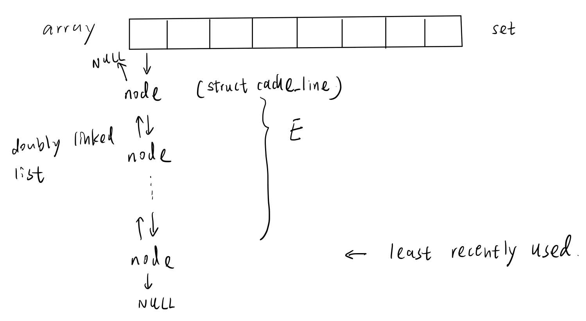

# Cache Lab
## Table of contents
- [Introduction](#introduction)
- [Duration](#duration)
- [Chapter](#chapter)

## Introduction
- At CMU we use this lab in place of the Performance Lab
- Students write a general-purpose cache simulator, and then optimize a small matrix transpose kernel to minimize the number of misses on a simulated cache
- Learn how the memory hierarchy works and how to exploit it

- This lab uses the Valgrind tool to generate address traces

- Note: This lab must be run on a 64-bit x86-64 system

## Duration
- 2025/2/27 - Due: 2025/3/8

## Chapter
- Chapter 6: The Memory Hierarchy

## Solution:

### Part A
- Overview of the simulated cache structure

    

### Part B
- `M = 32`, `N = 32` trace:

    ```
    S 10c080,1 miss 
    L 18c0e0,8 miss 
    L 18c0a4,4 miss 
    L 18c0a0,4 hit 
    L 10c0a0,4 miss eviction 
    S 14c0a0,4 miss eviction 
    L 10c0a4,4 miss eviction 
    S 14c120,4 miss 
    L 10c0a8,4 hit 
    S 14c1a0,4 miss 
    L 10c0ac,4 hit 
    S 14c220,4 miss 
    L 10c0b0,4 hit 
    S 14c2a0,4 miss 
    L 10c0b4,4 hit 
    S 14c320,4 miss 
    L 10c0b8,4 hit 
    S 14c3a0,4 miss 
    L 10c0bc,4 hit 
    S 14c420,4 miss 
    L 10c0c0,4 miss 
    S 14c4a0,4 miss eviction 
    ```

- We can speculate the address of `A`: `10c0a0`, the address of `B`: `14c0a0`
    - The difference of the addresses of `A` and `B` is

        $4 \times 16^4 = 2^{18}$

    - The definition of matrix `A` and `B` in `tracegen.c` is as follows

        ```c
        static int A[256][256];
        static int B[256][256];
        ```

        $256 \times 256 \times 4 = 2^{18}$
    
        Which is consistent with the above difference
    
    - Because the least three significant bits are the same, each row of `A` will have conflict miss with the corresponding row of `B`

#### M = 32, N = 32
- Every 8 rows of `B` will cause one conflict miss
    - Each time, we access the new row of `B`, the address increase `0x80`

        - $32 \times 4 = 2^7$ bytes
    
    - If the conflict miss occurs, the set bits are the same, the address will need to increase $2^{10}$

    - Therefore, every $2^{10} \div 2^{7} = 2^3$ rows will cause one conflict miss

    - For example, 1 and 2 will have the conflict miss, because both cache set are `00 001` 

        ```
          ** ***        <- set bits
        0000 0010 0000  <- 1
        0000 1010 0000
        0001 0010 0000
        0001 1010 0000
        0010 0010 0000
        0010 1010 0000
        0011 0010 0000
        0011 1010 0000

        0100 0010 0000  <- 2
        ```

#### M = 64, N = 64
#### M = 61, N = 67