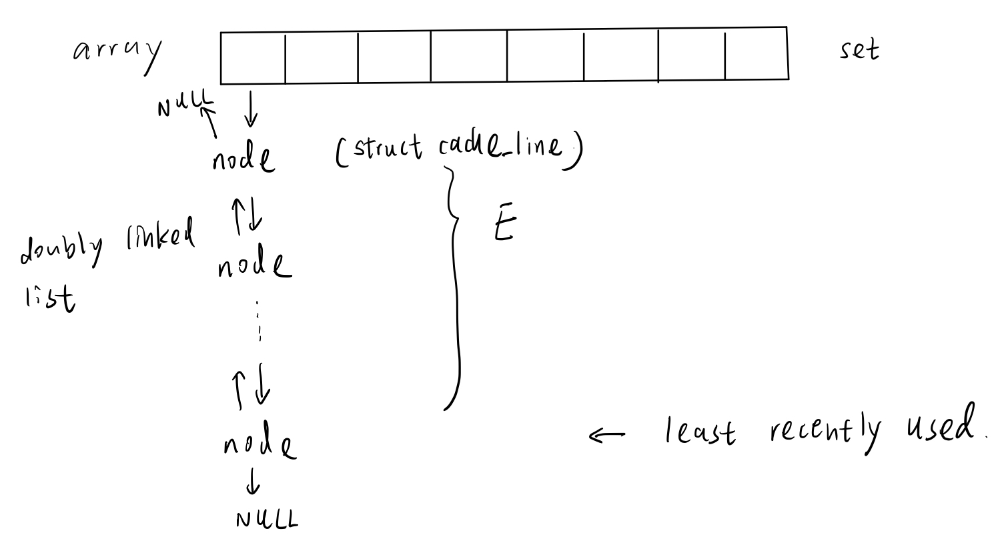
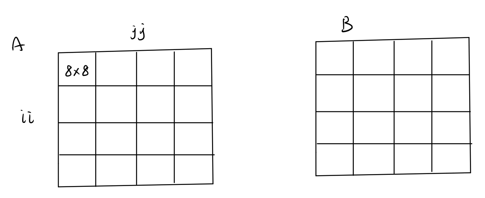
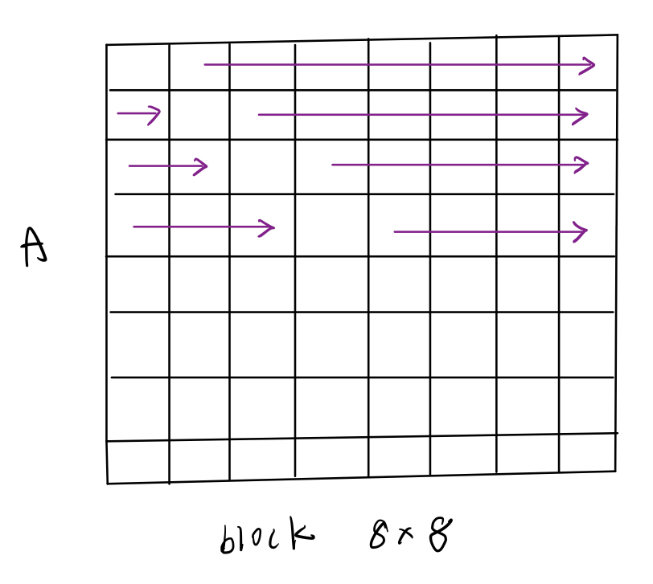
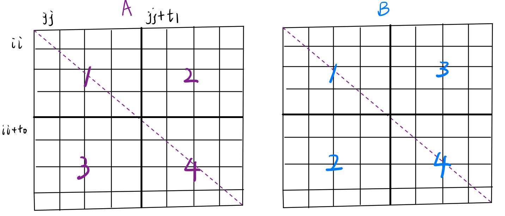

# Cache Lab
## Table of contents
- [Introduction](#introduction)
- [Duration](#duration)
- [Chapter](#chapter)

## Introduction
- At CMU we use this lab in place of the Performance Lab
- Students write a general-purpose cache simulator, and then optimize a small matrix transpose kernel to minimize the number of misses on a simulated cache
- Learn how the memory hierarchy works and how to exploit it

- This lab uses the Valgrind tool to generate address traces

- Note: This lab must be run on a 64-bit x86-64 system

## Duration
- 2025/2/27 - 2025/3/22

## Chapter
- Chapter 6: The Memory Hierarchy

## Solution:

### Part A
- Overview of the simulated cache structure

    

### Part B
- `M = 32`, `N = 32` trace:

    ```
    S 10c080,1 miss 
    L 18c0e0,8 miss 
    L 18c0a4,4 miss 
    L 18c0a0,4 hit 
    L 10c0a0,4 miss eviction 
    S 14c0a0,4 miss eviction 
    L 10c0a4,4 miss eviction 
    S 14c120,4 miss 
    L 10c0a8,4 hit 
    S 14c1a0,4 miss 
    L 10c0ac,4 hit 
    S 14c220,4 miss 
    L 10c0b0,4 hit 
    S 14c2a0,4 miss 
    L 10c0b4,4 hit 
    S 14c320,4 miss 
    L 10c0b8,4 hit 
    S 14c3a0,4 miss 
    L 10c0bc,4 hit 
    S 14c420,4 miss 
    L 10c0c0,4 miss 
    S 14c4a0,4 miss eviction 
    ```

- We can speculate the address of `A`: `10c0a0`, the address of `B`: `14c0a0`
    - The difference of the addresses of `A` and `B` is

        $4 \times 16^4 = 2^{18}$

    - The definition of matrix `A` and `B` in `tracegen.c` is as follows

        ```c
        static int A[256][256];
        static int B[256][256];
        ```

        $256 \times 256 \times 4 = 2^{18}$
    
        Which is consistent with the above difference
    
    - Because the least three significant bits are the same, each row of `A` will have conflict miss with the corresponding row of `B`

#### M = 32, N = 32
- Every 8 rows of `B` will cause one cache conflict
    - Each time, we access the new row of `B`, the address increase `0x80`
        - $32 \times 4 = 2^7$ bytes

        - Although the `A` and `B` matrices are allocated as $256 \times 256$, when they are passed as the function argument, there will be implicit transfer to the type `int A[N][M]` and `int B[M][N]` respectively
    
    - If the conflict miss occurs, the set bits are the same, the address will need to increase $2^{10}$

    - Therefore, every $2^{10} \div 2^{7} = 2^3$ rows will cause one conflict miss

    - For example, the address labeled with 1 and 2 will have the conflict miss, because both cache set are `00 001` 

        ```
              ** ***        <- set bits
        0   0000 0010 0000  <- 1
        1   0000 1010 0000
        2   0001 0010 0000
        3   0001 1010 0000
        4   0010 0010 0000
        5   0010 1010 0000
        6   0011 0010 0000
        7   0011 1010 0000

        8   0100 0010 0000  <- 2
        ```
    
- We will use the blocking technique, and because every 8 rows, there is a conflict miss, the block size will be 8 elements (32 bytes)  

    

- The block except in the diagonal in `A` will not have the conflict miss with its target
    - For example, because block [1, 0] in `B` has the same cache set as block [0, 0] in `A`, block [0, 1] in `A` and its target block [1, 0] in `B` have no conflict miss

    - Therefore, for the block out of the diagonal, we can simply transpose them

- For the diagonal block, we should skip the diagonal element when we do transposing, because when we access the diagonal element, the cache line of `A` and `B` will cause the conflict miss

    

- The final result 

    ```
    ./test-trans -M 32 -N 32

    Function 0 (5 total)
    Step 1: Validating and generating memory traces
    Step 2: Evaluating performance (s=5, E=1, b=5)
    func 0 (Transpose submission): hits:1765, misses:288, evictions:256

    Function 1 (5 total)
    Step 1: Validating and generating memory traces
    Step 2: Evaluating performance (s=5, E=1, b=5)
    func 1 (Simple row-wise scan transpose): hits:869, misses:1184, evictions:1152

    Function 2 (5 total)
    Step 1: Validating and generating memory traces
    Step 2: Evaluating performance (s=5, E=1, b=5)
    func 2 (Simple row-wise scan transpose without temporary value): hits:869, misses:1184, evictions:1152

    Function 3 (5 total)
    Step 1: Validating and generating memory traces
    Step 2: Evaluating performance (s=5, E=1, b=5)
    func 3 (Transpose no diagonal): hits:1709, misses:344, evictions:312

    Function 4 (5 total)
    Step 1: Validating and generating memory traces
    Step 2: Evaluating performance (s=5, E=1, b=5)
    func 4 (Transpose diagonal): hits:1765, misses:288, evictions:256

    Summary for official submission (func 0): correctness=1 misses=288

    TEST_TRANS_RESULTS=1:288

    ```
#### M = 64, N = 64
- Every 4 rows will cause one cache conflict

    
    - A1 transposes to B1
    - When A2 transposes to B2, B2 will have conflicts with B1

- We use the following method to completely elimiate the cache conflict when we tranpose non-diagonal block

    Index|Operation | Cache
    -|-|-
    1|A1 -> B1 | A1, A2, B1, B3
    2|A2 -> B3 (not B2)|
    3|Save B3 row 0 to local variable
    4|Get A3 column 0 to replace B3 row 0|A3, A4, B1, B3
    5|Save B3 row 0 local variable to B2 row 0|A3, A4, (B2, B4 row 0), (B1, B3 row 1-3) 
    6|Repeat operation 3-5|A3, A4, B2, B4
    7|A4 -> B4

- For diagonal $8 \times 8$ block, we split it into 4 $4 \times 4$ small block and tranpose them in column-major order

    
    - This method is not fully optimized 

- The final result

    ```
    ./test-trans -M 64 -N 64

    Function 0 (2 total)
    Step 1: Validating and generating memory traces
    Step 2: Evaluating performance (s=5, E=1, b=5)
    func 0 (Transpose submission): hits:8785, misses:1204, evictions:1172
    ```
#### M = 61, N = 67
- We only hit 2133 misses, to be done