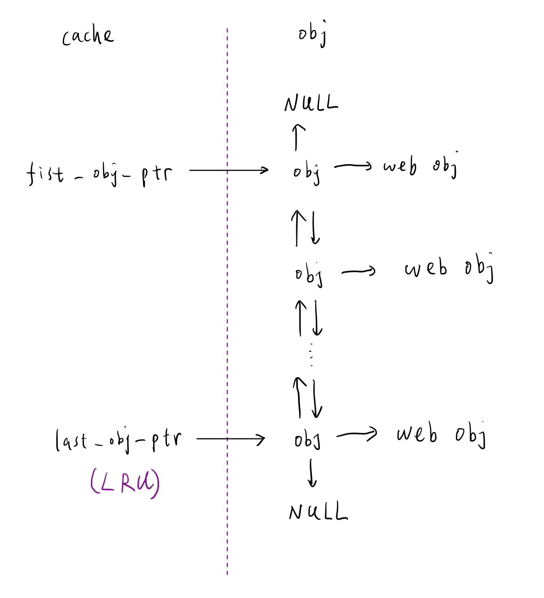

# Proxy Lab

## Table of contents
- [Introduction](#introduction)

- [Duration](#duration)

- [Chapter](#chapter)

- [Solution](#solution)
    - [Part I: implementing a sequential web proxy](#part-i-implementing-a-sequential-web-proxy)
    - [Part II: dealing with multiple concurrent requests](#part-ii-dealing-with-multiple-concurrent-requests)
    - [Part III: caching web objects](#part-iii-caching-web-objects)

- [TO DO](#to-do)

## Introduction
- Students implement a concurrent caching Web proxy that sits between their browser and the rest of the World Wide Web
- This lab exposes students to the interesting world of network programming, and ties together many of the concepts from the course, such as byte ordering, caching, process control, signals, signal handling, file I/O, concurrency, and synchronization

## Duration
- 2025/5/21 - 2025/6/4

## Chapter
- Chapter 10: System-Level I/O
- Chapter 11: Network Programming
- Chapter 12: Concurrent Programming

## Solution
### Part I: implementing a sequential web proxy
- Basic workflow

    
    1. Listen for incoming connections
        - Read the entirety of the request from the client and parse the request
        - Varify the HTTP request

    2. Establish connection to web server and request object the client specified
    3. Read the server's response
    4. Forward it to the client

- Error-handling functions modification
    - Temporarily remove `exit()`
    1. Original function
    1. Add error message, return original rc
    1. Application level, based on rc, do some actions

- Result:

    ```
    *** Basic ***
    Starting tiny on 15021
    Starting proxy on 24858
    1: home.html
    Fetching ./tiny/home.html into ./.proxy using the proxy
    Fetching ./tiny/home.html into ./.noproxy directly from Tiny
    Comparing the two files
    Success: Files are identical.
    2: csapp.c
    Fetching ./tiny/csapp.c into ./.proxy using the proxy
    Fetching ./tiny/csapp.c into ./.noproxy directly from Tiny
    Comparing the two files
    Success: Files are identical.
    3: tiny.c
    Fetching ./tiny/tiny.c into ./.proxy using the proxy
    Fetching ./tiny/tiny.c into ./.noproxy directly from Tiny
    Comparing the two files
    Success: Files are identical.
    4: godzilla.jpg
    Fetching ./tiny/godzilla.jpg into ./.proxy using the proxy
    Fetching ./tiny/godzilla.jpg into ./.noproxy directly from Tiny
    Comparing the two files
    Success: Files are identical.
    5: tiny
    Fetching ./tiny/tiny into ./.proxy using the proxy
    Fetching ./tiny/tiny into ./.noproxy directly from Tiny
    Comparing the two files
    Success: Files are identical.
    Killing tiny and proxy
    basicScore: 40/40
    ```

### Part II: dealing with multiple concurrent requests
- Use prethreading to deal with multiple concurrent requests

- Result:

    ```
    *** Concurrency ***
    Starting tiny on port 28477
    Starting proxy on port 17211
    Starting the blocking NOP server on port 11448
    Trying to fetch a file from the blocking nop-server
    Fetching ./tiny/home.html into ./.noproxy directly from Tiny
    Fetching ./tiny/home.html into ./.proxy using the proxy
    Checking whether the proxy fetch succeeded
    Success: Was able to fetch tiny/home.html from the proxy.
    Killing tiny, proxy, and nop-server
    concurrencyScore: 15/15
    ```

### Part III: caching web objects
- The maximum amount of data your proxy will ever use is:

    ```
    MAX_CACHE_SIZE + T * MAX_OBJECT_SIZE
    ```
    - This means the maximum cache size is still `MAX_CACHE_SIZE`
    - At the same time, there are `T` actice connections and they accumulate `MAX_OBJECT_SIZE` bytes data in the buffer

- Data structure

    

    - Object structure

        ```c
        typedef struct
        {
            void *buf;
            int size;
            char *key;      /* Use {hostname}:{port}{path} as key */

            obj_t *pre;
            obj_t *next;
        } obj_t;
        ```
        - `free` function: free `obj.buf` then free `obj`


    - Cache structure:

        ```c
        typedef struct
        {
            int size;
            obj_t *first_obj_ptr;
            obj_t *last_obj_ptr;

            int read_cnt;           /* For first readers-writers problem */
            sem_t mutex, w;
        } cache_t;
        ```
        - `init` function 
            - Initialize `read_cnt`, `mutex`, `w`

        - `read`, `write` function
            - First readers-writers problem

- Pseudo code:
    - Multiple readers can access the cache (cache unchanged)
    - After read, return pointer to the item

    - If point != NULL (In cache)
        - Get cached object
        - Change cache organization to implement LRU
        - Serve object to client

    - If pointer == NULL (No cache)
        - Assign `MAX_OBJECT_SIZE` buffer `object_buf`

            ```c
            char object_buf[MAX_OBJECT_SIZE]; 
            char *object_ptr = object_buf;
            ```
        
        - Cumulative bytes `total_bytes`

        - Connect to server

        - Read `MAXBUF` object into `buf`
            - Serve object to client

                ```
                total_bytes += read_bytes
                ```

            - If `total_bytes` <= `MAX_OBJECT_SIZE`
                - Append `buf` to `object_buf`

                    ```
                    memcpy(object_ptr, buf, read_bytes);
                    object_ptr += read_bytes
                    ```
                
                - Repeat read until EOF

                - Dynamically Allocate `obj_t` and `obj.buf`
                    - Init `obj.buf` based on `object_buf` and object size
        
        - If cache size + object size > `MAX_CACHE_SIZE`
            - Evict some the least recently used (LRU) objects until size <= `MAX_CACHE_SIZE`

        - Store object into cache

- Result:

    ```
    *** Cache ***
    Starting tiny on port 30131
    Starting proxy on port 18641
    Fetching ./tiny/tiny.c into ./.proxy using the proxy
    Fetching ./tiny/home.html into ./.proxy using the proxy
    Fetching ./tiny/csapp.c into ./.proxy using the proxy
    Killing tiny
    Fetching a cached copy of ./tiny/home.html into ./.noproxy
    Success: Was able to fetch tiny/home.html from the cache.
    Killing proxy
    cacheScore: 15/15
    ```

- Web browsers
    - Test proxy using the 139.0.4 Mozilla Firefox

    - Configure Firefox to work with a proxy

        

    - It works well with `tiny` server or other servers with only `GET` http request
        - For example, when I connect to `wwww.google.com`, it uses `CONNECT` method
    
### TO DO:
- Error handling
    - If `P(v)` error, what should I do?
    - If `Pthread_detach` error, what should I do?
    - Terminate thread?

- Proxy ignore SIGPIPE signal (page 964)?
    - `write` return EPIPE errors?
    - How to generate this error?

- Prematurely close, `read` turn -1 with `errno` set to `ECONNRESET`
    - Proxy should not terminate due to this error
    - How to generate this error?


- `free sbuf` in `SIGINT` signal handler
    - Only consider to terminate the process with `ctrl-c` (`SIGINT`)
    - Is there any better method?
    - Run the program with Valgrind, we succuessfully eliminate the `sbuf` possible lost problem, but there are other possible lost?

        ```
        valgrind --leak-check=full --show-leak-kinds=all ./proxy 2702
        ==274227== Memcheck, a memory error detector
        ==274227== Copyright (C) 2002-2017, and GNU GPL'd, by Julian Seward et al.
        ==274227== Using Valgrind-3.18.1 and LibVEX; rerun with -h for copyright info
        ==274227== Command: ./proxy 2702
        ==274227== 
        ^CKill proxy process group, process group id: 274227
        ==274227== 
        ==274227== HEAP SUMMARY:
        ==274227==     in use at exit: 3,672 bytes in 6 blocks
        ==274227==   total heap usage: 12 allocs, 6 frees, 8,564 bytes allocated
        ==274227== 
        ==274227== 1,024 bytes in 1 blocks are still reachable in loss record 1 of 3
        ==274227==    at 0x4848899: malloc (in /usr/libexec/valgrind/vgpreload_memcheck-amd64-linux.so)
        ==274227==    by 0x48E1BA3: _IO_file_doallocate (filedoalloc.c:101)
        ==274227==    by 0x48F0CDF: _IO_doallocbuf (genops.c:347)
        ==274227==    by 0x48EFF5F: _IO_file_overflow@@GLIBC_2.2.5 (fileops.c:744)
        ==274227==    by 0x48EE6D4: _IO_new_file_xsputn (fileops.c:1243)
        ==274227==    by 0x48EE6D4: _IO_file_xsputn@@GLIBC_2.2.5 (fileops.c:1196)
        ==274227==    by 0x48D814C: outstring_func (vfprintf-internal.c:239)
        ==274227==    by 0x48D814C: __vfprintf_internal (vfprintf-internal.c:1263)
        ==274227==    by 0x48C379E: printf (printf.c:33)
        ==274227==    by 0x10B2CD: sigint_handler (proxy.c:275)
        ==274227==    by 0x48A551F: ??? (in /usr/lib/x86_64-linux-gnu/libc.so.6)
        ==274227==    by 0x498A45C: accept (accept.c:26)
        ==274227==    by 0x10B67F: Accept (helper.c:102)
        ==274227==    by 0x10A7E0: main (proxy.c:60)
        ==274227== 
        ==274227== 1,088 bytes in 4 blocks are possibly lost in loss record 2 of 3
        ==274227==    at 0x484DA83: calloc (in /usr/libexec/valgrind/vgpreload_memcheck-amd64-linux.so)
        ==274227==    by 0x40147D9: calloc (rtld-malloc.h:44)
        ==274227==    by 0x40147D9: allocate_dtv (dl-tls.c:375)
        ==274227==    by 0x40147D9: _dl_allocate_tls (dl-tls.c:634)
        ==274227==    by 0x48F87B4: allocate_stack (allocatestack.c:430)
        ==274227==    by 0x48F87B4: pthread_create@@GLIBC_2.34 (pthread_create.c:647)
        ==274227==    by 0x10B82A: Pthread_create (helper.c:138)
        ==274227==    by 0x10A7A8: main (proxy.c:54)
        ==274227== 
        ==274227== 1,560 bytes in 1 blocks are still reachable in loss record 3 of 3
        ==274227==    at 0x48487A9: malloc (in /usr/libexec/valgrind/vgpreload_memcheck-amd64-linux.so)
        ==274227==    by 0x49A6D76: make_request (check_pf.c:235)
        ==274227==    by 0x49A6D76: __check_pf (check_pf.c:329)
        ==274227==    by 0x496EB77: getaddrinfo (getaddrinfo.c:2347)
        ==274227==    by 0x10B70F: Getaddrinfo (helper.c:114)
        ==274227==    by 0x10BFBD: open_listenfd (helper.c:453)
        ==274227==    by 0x10A751: main (proxy.c:45)
        ==274227== 
        ==274227== LEAK SUMMARY:
        ==274227==    definitely lost: 0 bytes in 0 blocks
        ==274227==    indirectly lost: 0 bytes in 0 blocks
        ==274227==      possibly lost: 1,088 bytes in 4 blocks
        ==274227==    still reachable: 2,584 bytes in 2 blocks
        ==274227==         suppressed: 0 bytes in 0 blocks
        ==274227== 
        ==274227== For lists of detected and suppressed errors, rerun with: -s
        ==274227== ERROR SUMMARY: 1 errors from 1 contexts (suppressed: 0 from 0)
        Killed
        ```
        - Why possibly lost
        - May refer to https://stackoverflow.com/questions/3840582/valgrind-still-reachable-leak-detected-by-valgrind, but the pointer to `struct addrinfo` is discarded, why is still reachable?

- Tiny error: Rio_writen error: Connection reset by peer?
    - Only appear once?

- `line:netp:doit:parserequest` (`doit` in tiny.c) note meaning?