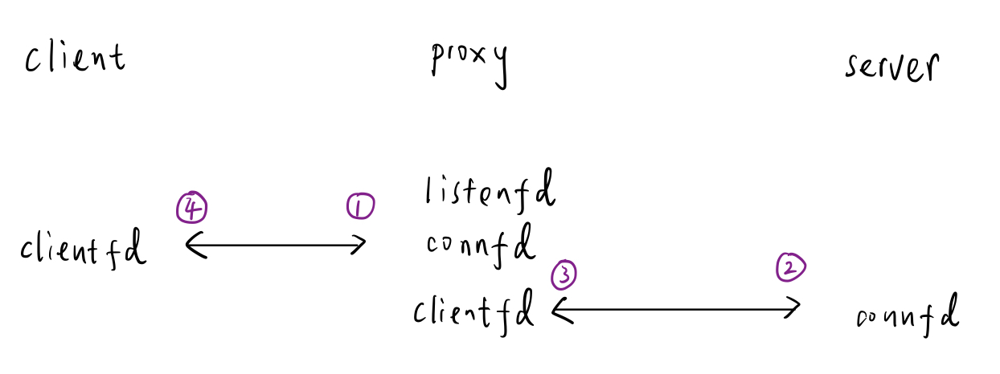

# Proxy Lab

## Table of contents
- [Introduction](#introduction)

- [Duration](#duration)

- [Chapter](#chapter)

- [Solution](#solution)
    - [Part I: implementing a sequential web proxy](#part-i-implementing-a-sequential-web-proxy)
    - [Part II: dealing with multiple concurrent requests](#part-ii-dealing-with-multiple-concurrent-requests)
    - [Part III: caching web objects](#part-iii-caching-web-objects)

## Introduction
- Students implement a concurrent caching Web proxy that sits between their browser and the rest of the World Wide Web
- This lab exposes students to the interesting world of network programming, and ties together many of the concepts from the course, such as byte ordering, caching, process control, signals, signal handling, file I/O, concurrency, and synchronization

## Duration
- 2025/5/21 - 2025/6/4

## Chapter
- Chapter 10: System-Level I/O
- Chapter 11: Network Programming
- Chapter 12: Concurrent Programming

## Solution
### Part I: implementing a sequential web proxy
- Basic workflow

    
    1. Listen for incoming connections
        - Read the entirety of the request from the client and parse the request
        - Varify the HTTP request

    2. Establish connection to web server and request object the client specified
    3. Read the server's response
    4. Forward it to the client

- TO DO:
    - Error-handling functions modification
        - Temporarily remove `exit()`
        1. Original function
        1. Add error message, return original rc
        1. Application level, based on rc, do some actions

    - `request_line_t` struct type?
    
    - `proxy.c: main`
        - Is there any better method to handle error?
    
    - `line:netp:doit:parserequest` (`doit` in tiny.c) note meaning?

    - Proxy ignore SIGPIPE signal (page 964)?
        - `write` return EPIPE errors?

    - Tiny error: Rio_writen error: Connection reset by peer?
        - Only appear once?
    
    - Prematurely close, `read` turn -1 with `errno` set to `ECONNRESET`
        - Proxy should not terminate due to this error
    
    - `static` function must be written front? because no header
    - Expose all the function in the header file?

    - Tiny: `clienterror` http response has no content-length response header, so how do I read response body?

### Part II: dealing with multiple concurrent requests

### Part III: caching web objects