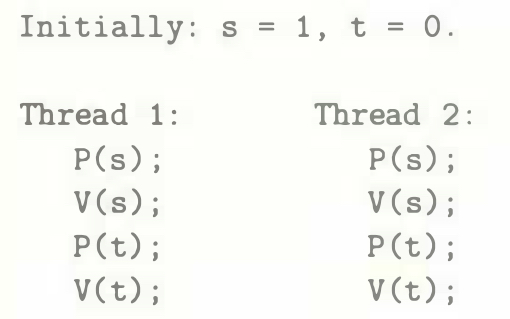
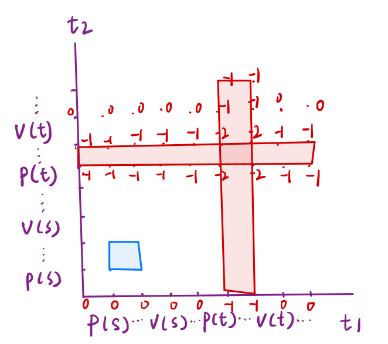

# Practice Problem 12.15 (solution page 1039)
Consider the following program, which attempts to use a pair of semaphores for mutual exclusion.

A. Draw the progress graph for this program.

B. Does it always deadlock?

C. If so, what simple change to the initial semaphore values will eliminate the potential for deadlock?

D. Draw the progress graph for the resulting deadlock-free program.

## Solution:
- A:

    

- B: yes

- C: `t = 1`

- D:

    