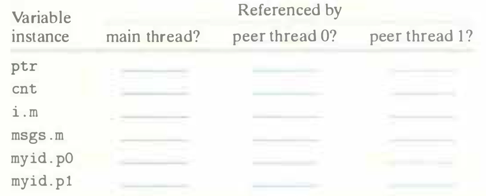

# Practice Problem 12.6 (solution page 1036)
A. Using the analysis from Section 12.4, fill each entry in the following table with "Yes" or "No" for the example program in Figure 12.15. In the first column, the notation $v.t$ denotes an instance of variable $v$ residing on the local stack for thread $t$, where $t$ is either `m` (main thread), `p0` (peer thread 0), or `p1` (peer thread 1).

B. Given the analysis in part A, which of the variables `ptr`, `cnt`, `i`, `msgs`, and `myid` are shared?

## Solution:

A.

Variable||Referenced by||
-|-|-|-
instance|main thread?|peer thread 0?|peer thread 1?
`ptr`|Yes|Yes|Yes
`cnt`|No|Yes|Yes
`i.m`|Yes|No|No
`msgs.m`|Yes|Yes|Yes
`myid.p0`|No|Yes|No
`myid.p1`|No|No|Yes

B. `ptr`, `cnt`, `msgs` are shared