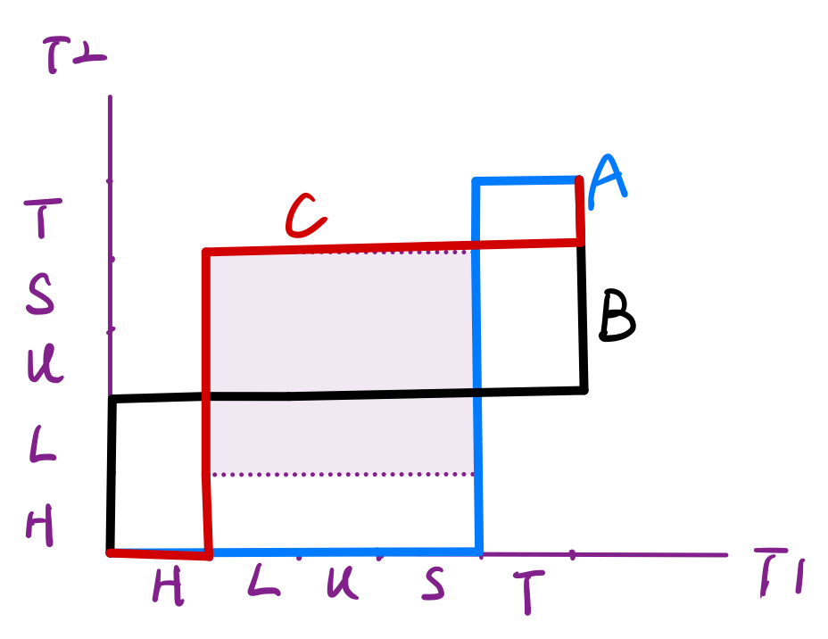

# Practice Problem 12.8 (solution page 1038)
Using the progress graph in Figure 12.21, classify the following trajectories as either safe or unsafe

A. $H_1, L_1, U_1, S_1, H_2, L_2, U_2. S_2, T_2, T_1$

B. $H_2, L_2, H_1, L_1, U_1, S_1, T_1, U_2, S_2, T_2$

C. $H_1, H_2, L_2, U_2, S_2, L_1, U_1, S_1, T_1. T_2 

## Solution:

A. safe

B. unsafe

C. safe