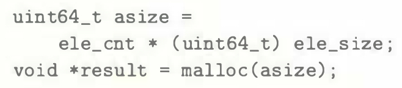

# Practice Problem 2.37 (solution page 155)
You are given the task of patching the vulnerability in the XDR code shown in the aside on page 100 for the case where both data types `int` and `size_t` are 32 bits. You decide to eliminate the possibility of the multiplication overflowing by computing the number of bytes to allocate using data type `uint64_t`. You replace the original call to `malloc` (line 9) as follows:

Recall that the argument to `malloc` has type `size_t`.

A. Does your code provide any improvement over the original?

B. How would you change the code to eliminate the vulnerability?

## Solution:

A. No, while `asize` is 64-bit unsigned number, `malloc` argument type `size_t` is still 32-bit data type 