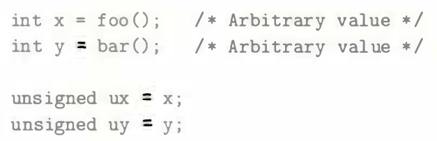
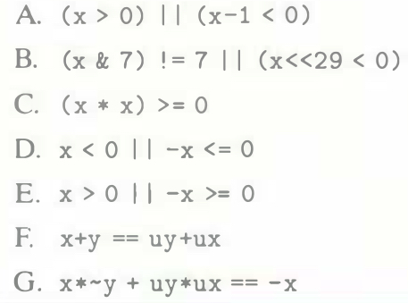

# Practice Problem 2.44 (solution page 157)
Assume data type `int` is 32 bits long and uses a two's-complement representation for signed values. Right shifts are performed arithmetically for signed values and logically for unsigned values. The variables are declared and initialized as follows:

For each of the following C expressions, either (1) argue that it is true (evaluates to 1) for all values of `x` and `y`, or (2) give values of `x` and `y` for which it is false (evaluates to 0):

