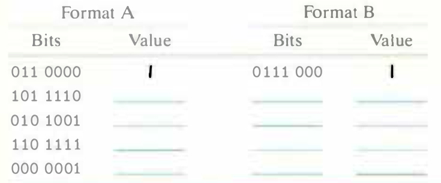

# Practice Problem 2.52 (solution page 160)
Consider the following two 7-bit floating-point representations based on the lEEE floating-point format. Neither has a sign bit—they can only represent nonnegative numbers.

1. Format A
    - There are $k = 3$ exponent bits. The exponent bias is 3.
    - There are $n = 4$ fraction bits.

2. Format B
    - There are $k = 4$ exponent bits. The exponent bias is 7.
    - There are $n = 3$ fraction bits.

Below, you are given some bit patterns in format A, and your task is to convert them to the closest value in format B. If necessary, you should apply the round-to-even rounding rule. In addition, give the values of numbers given by the format A and format B bit patterns. Give these as whole numbers (e.g., $17$) or as fractions (e.g., $17/64$).

