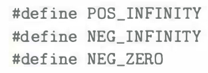

# Practice Problem 2.53 (solution page 160)
Fill in the following macro definitions to generate the double-precision values $+\infty$, $-\infty$, and $-0$:

You cannot use any include files (such as `math.h`), but you can make use of the fact that the largest finite number that can be represented with double precision is around $1.8 \times 10^{308}$

## Solution:
#define POS_INFINITY #define NEG_INFINITY
#define NEG_ZERO