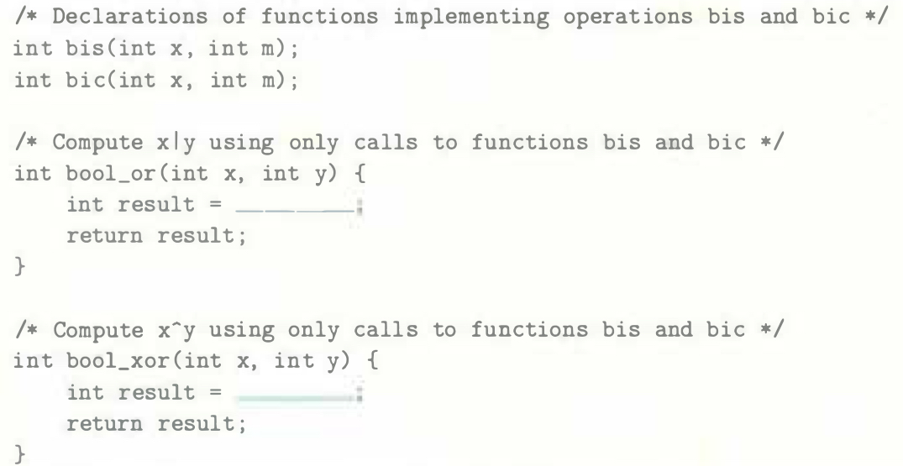

# Practice Problem 2.13 
Solution page 147

The Digital Equipment VAX computer was a very popular machine from the late 1970s until the late 1980s. Rather than instructions for Boolean operations `AND` and `OR`, it had instructions `bis` (bit set) and `bic` (bit clear). Both instructions take a data word `x` and a mask word `m`. They generate a result `z` consisting of the bits of `x` modified according to the bits of `m`. With `bis`, the modification involves setting `z` to `1` at each bit position where `m` is `1`. With `bic`, the modification involves setting `z` to `O` at each bit position where `m` is `1`.

To see how these operations relate to the C bit-level operations, assume we have functions `bis` and `bic` implementing the bit set and bit clear operations, and that we want to use these to implement functions computing bitwise operations `|` and `^`, without using any other C operations. Fill in the missing code below. Hint: Write C expressions for the operations bis and bic.



## Solution:
- Answer:
    ```c
    int bool_or(int x, int y) {
        int result = bis(x, y);
        return result;
    }

    int bool_xor(int x, int y) {
        int result = bis(bic(x, y), bic(y, x));
        return result;
    }
    ```

- `bool_or`:
    - In terms of masking, `x | y` is if the bit of `y` is `1`, then modify `x` to `1`, otherwise keep `x` unchanged

    - This definition is the same as `bis` function

- `bool_xor`:
    - In terms of masking, `x & ~y` is if the bit of `y` is `1`, then modify `x` to `0`, otherwise keep `x` unchanged
    - This definition is the same as `bic` function which means `x & ~y` is equivalent to `bic(x, y)` 

    - ` x ^ y = (x & ~y) | (~x & y) = bis(bic(x, y), bic(y, x))`

        ```
        x           0 0 1 1
        y           0 1 0 1
        ^           0 1 1 0
        bic(x, y)   0 0 1 0
        bic(y, x)   0 1 0 0
        ```
