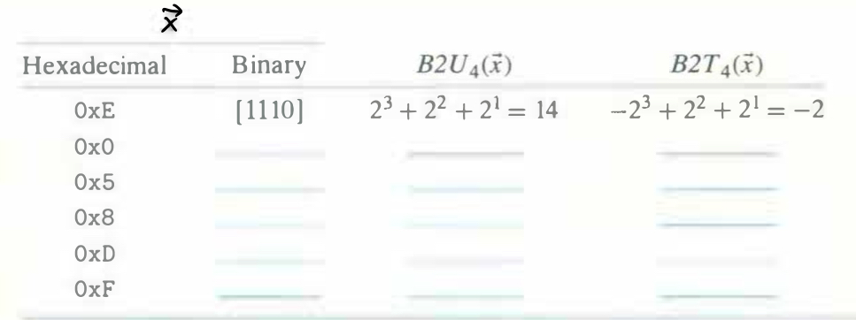

# Practice Problem 2.17 (solution page 148)
Assuming $w = 4$, we can assign a numeric value to each possible hexadecimal digit, assuming either an unsigned or a two's-complement interpretation. Fill in the following table according to these interpretations by writing out the nonzero powers of 2 in the summations shown in Equations 2.1 and 2.3:

## Solution:
|Hexadecimal|Binary|$B2U_4(\vec{x})$|$B2T_4(\vec{x})$|
|-|-|-|-|
|0xE|`[1110]`|$2^3+2^2+2^1 = 14$|$-2^3+2^2+2^1 = -2$|
|0x0|`[0000]`|$0$|$0$|
|0x5|`[0101]`|$2^2+2^0 = 5$|$2^2+2^0 = 5$|
|0x8|`[1000]`|$2^3 = 8$|$-2^3 = -8$|
|0xD|`[1101]`|$2^3+2^2+2^0 = 13$|$-2^3+2^2+2^0 = -3$|
|0xF|`[1111]`|$2^3+2^2+2^1+2^0 = 15$|$-2^3+2^2+2^1+2^0 = -1$|