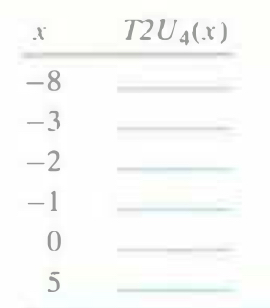

# Practice Problem 2.19 (solution page 149)
Using the table you filled in when solving Problem 2.17. fill in the following table describing the function $T2U_4$:

## Solution:

|$x$|$T2U_4(x)$|
|-|-|
|-8|8|
|-3|13|
|-2|14|
|-1|15|
|0|0|
|5|5|