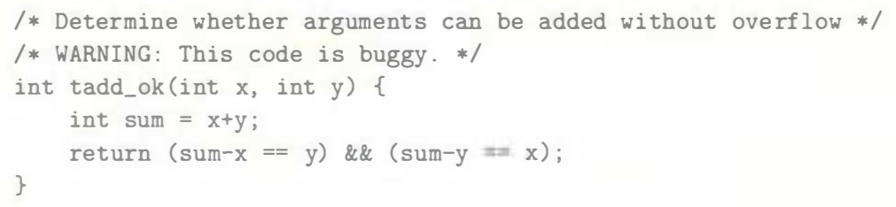

# Practice Problem 2.31 (solution page 153)
Your coworker gets impatient with your analysis of the overflow conditions for two's-complement addition and presents you with the following implementation of tadd_ok:

You look at the code and laugh. Explain why.

## Solution:
- Two's-complement addition forms an abelian group
    - Even sum is overflowed, `sum - x` is still equal to `y`

- Example $w = 4$

    |Variable|Binary|Decimal|
    |-|-|-|
    |`x`|`0111`|7|
    |`y`|`0110`|6|
    |`x+y`|`01101`|13|
    |`sum`|`1101`|-3|
    |`-x`|`1001`|-7|
    |`sum-x`|`10110`|-10|
    |$sum+_4^t(-x)$|`0110`|6|