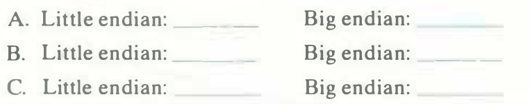

# Practice Problem 2.5 (solution page 144)
Consider the following three calls to `show_bytes`:

```c
int val = Ox87654321;
byte_pointer valp = (byte_pointer) &val;
show_bytes(valp, 1); /* A. */
show_bytes(valp, 2); /* B. */
show_bytes(valp, 3); /* C. */
```
Indicate the values that will be printed by each call on a little-endian machine and on a big-endian machine:



## Solution:
A. Little endian: `21`          Big endian: `87`

B. Little endian: `21 43`       Big endian: `87 65`

C. Little endian: `21 43 65`    Big endian: `87 65 43`
