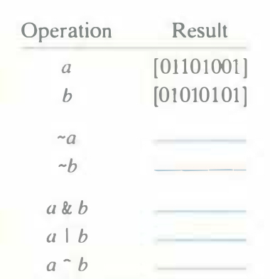

# Practice Problem 2.8 (solution page 145)
Fill in the following table showing the results of evaluating Boolean operations on bit vectors.

## Solution:
Operation|Result
-|-
a|[0110 1001]
b|[0101 0101]
~a|[1001 0110]
~b|[1010 1010]
a & b|[0100 0001]
a \| b|[0111 1101]
a ^ b|[0011 1100]