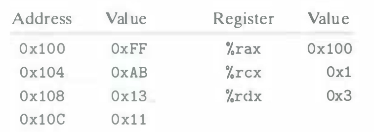
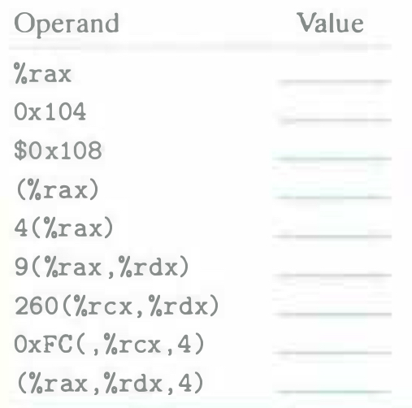

# Practice Problem 3.1 (solution page 325)
Assume the following values are stored at the indicated memory addresses and registers:

Fill in the following table showing the values for the indicated operands:

