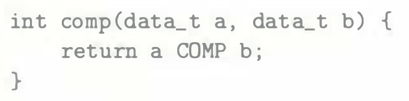

# Practice Problem 3.13 (solution page 330)
The C code

shows a general comparison between arguments `a` and `b`, where `data_t`, the data type of the arguments, is defined (via `typedef`) to be one of the integer data types listed in Figure 3.1 and either signed or unsigned. The comparison `COMP` is defined via `#define`.

Suppose `a` is in some portion of `%rdi` while `b` is in some portion of `%rsi`. For each of the following instruction sequences, determine which data types `data_t` and which comparisons `COMP` could cause the compiler to generate this code. (There can be multiple correct answers; you should list them all!)

## Solution: