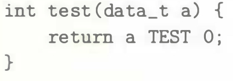
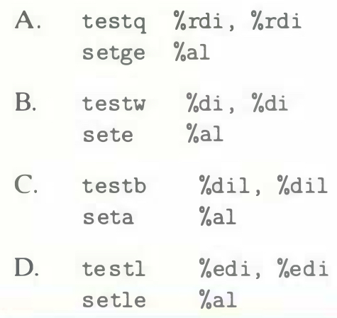

# Practice Problem 3.14 (solution page 330)
The C code

shows a general comparison between argument `a` and 0, where we can set the data type of the argument by declaring `data_t` with a `typedef`, and the nature of the comparison by declaring `TEST` with a `#define` declaration. The following instruction sequences implement the comparison, where `a` is held in some portion of register `%rdi`. For each sequence, determine which data types `data_t` and which comparisons `TEST` could cause the compiler to generate this code. (There can be multiple correct answers; list all correct ones.)

## Solution:

A. testq %rdi, brdi
setge %al

B.
testw sete
%di, %di
%al
С.
testb
seta
%dil, %dil %al

D. testl setle
%edi, %edi
%al