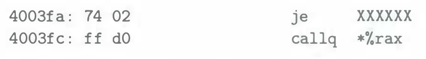
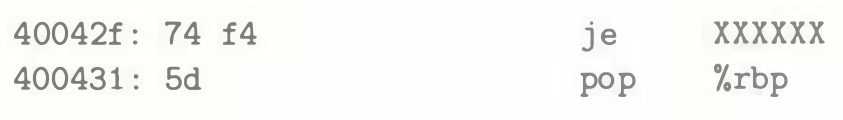
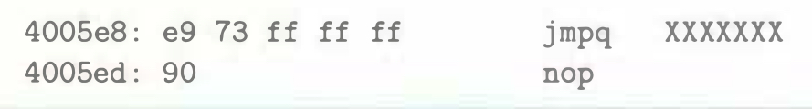

# Practice Problem 3.15 (solution page 330)
In the following excerpts from a disassembled binary, some of the information has been replaced by X's. Answer the following questions about these instructions.

A. What is the target of the `je` instruction below? (You do not need to know anything about the `callq` instruction here.)

B. What is the target of the `je` instruction below?

C. What is the address of the `ja` and `pop` instructions?

D. In the code that follows, the jump target is encoded in PC-relative form as a 4-byte two's-complement number. The bytes are listed from least significant to most, reflecting the little-endian byte ordering of x86-64. What is the address of the jump target?

