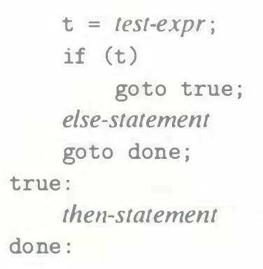

# Practice Problem 3.17 (solution page 331)
An alternate rule for translating if statements into goto code is as follows:

A. Rewrite the goto version of `absdiff_se` based on this alternate rule.

B. Can you think of any reasons for choosing one rule over the other?