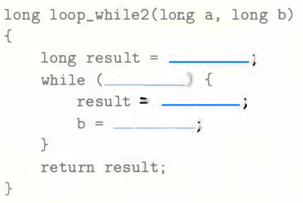
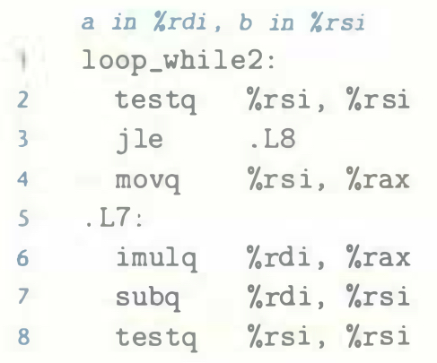
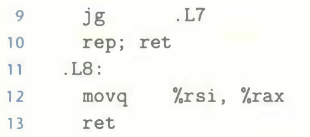

# Practice Problem 3.25 (solution page 335)
For C code having the general form

`GCC`, run with command-line option `-O1`, produces the following code:

We can see that the compiler used a guarded-do translation, using the `jle` instruction on line 3 to skip over the loop code when the initial test fails. Fill in the missing parts of the C code. Note that the control structure in the assembly code does not exactly match what would be obtained by a direct translation of the C code according to our translation rules. In particular, it has two different `ret` instructions (lines 10 and 13). However, you can fill out the missing portions of the C code in a way that it will have equivalent behavior to the assembly code.