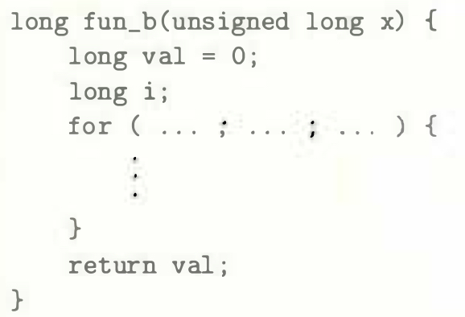

# Practice Problem 3.28 (solution page 336)
A function `fun_b` has the following overall structure:

The `GCC` C compiler generates the following assembly code:

Reverse engineer the operation of this code and then do the following:

A. Use the assembly-code version to fill in the missing parts of the C code.

B. Explain why there is neither an initial test before the loop nor an initial jump to the test portion of the loop.

C. Describe in English what this function computes.