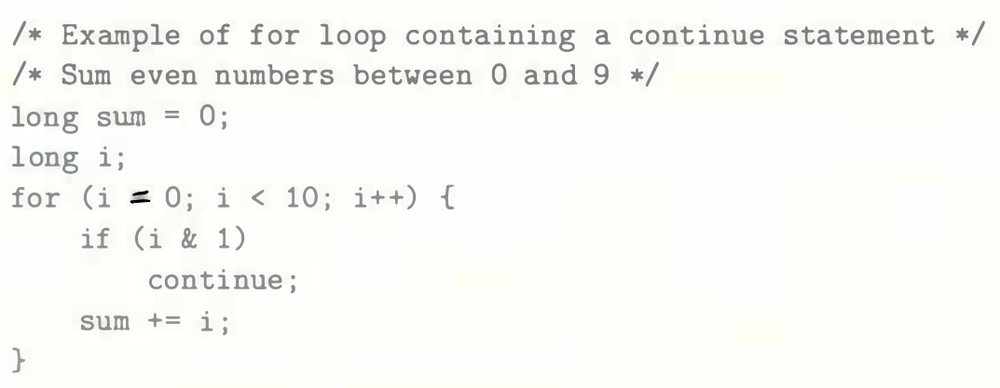

# Practice Problem 3.29 (solution page 337)
Executing a `continue` statement in C causes the program to jump to the end of the current loop iteration. The stated rule for translating a `for` loop into a `while` loop needs some refinement when dealing with `continue` statements. For example, consider the following code:



A. What would we get if we naively applied our rule for translating the `for` loop into a `while` loop? What would be wrong with this code?

B. How could you replace the `continue` statement with a `goto` statement to ensure that the while loop correctly duplicates the behavior of the `for` loop?

## Solution:

```c
long sum = 0;
long i;
i = 0

while (i < 10){
    if (i & 1)
        continue;

    sum += i;

    i++
}
```

infinite loop