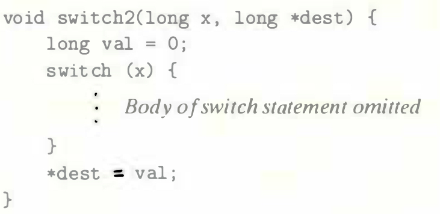
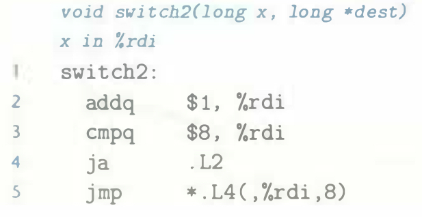
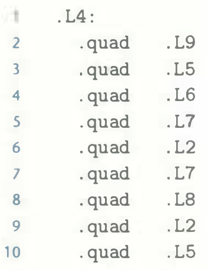

# Practice Problem 3.30 (solution page 338)
In the C function that follows, we have omitted the body of the `switch` statement.
In the C code, the case labels did not span a contiguous range, and some cases had multiple labels.

In compiling the function, `GCC` generates the assembly code that follows for the initial part of the procedure, with variable `x` in `%rdi`:

It generates the following code for the jump table:

Based on this information, answer the following questions:

A. What were the values of the case labels in the `switch` statement?

B. What cases had multiple labels in the C code?