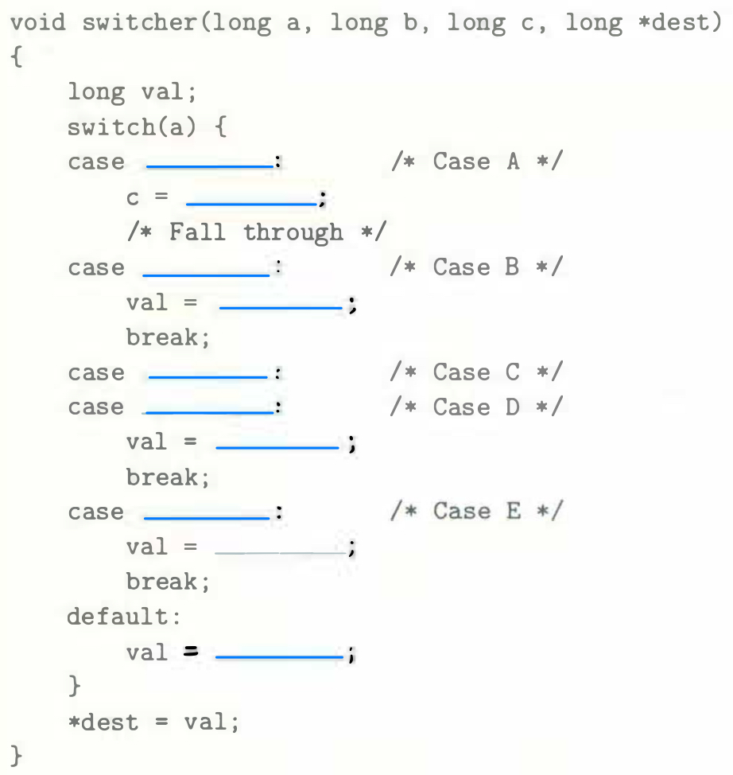
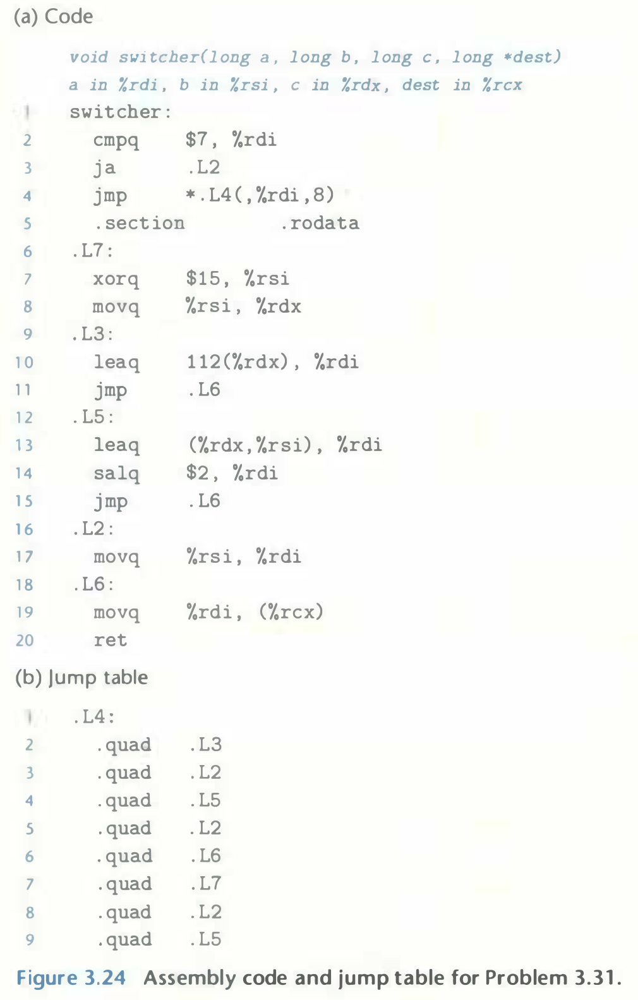

# Practice Problem 3.31 (solution page 338)
For a C function `switcher` with the general structure

`GCC` generates the assembly code and jump table shown in Figure 3.24.

Fill in the missing parts of the C code. Except for the ordering of case labels `C` and `D`, there is only one way to fit the different cases into the template.