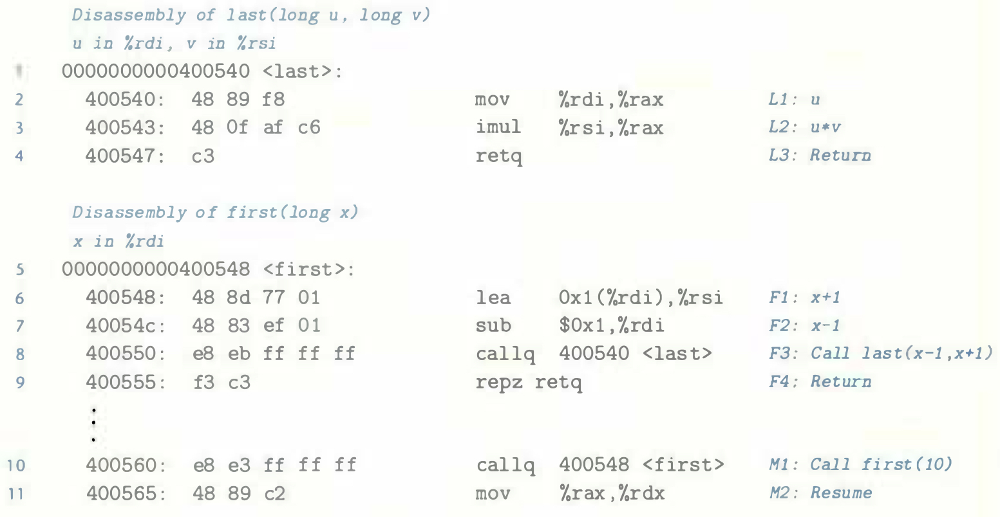
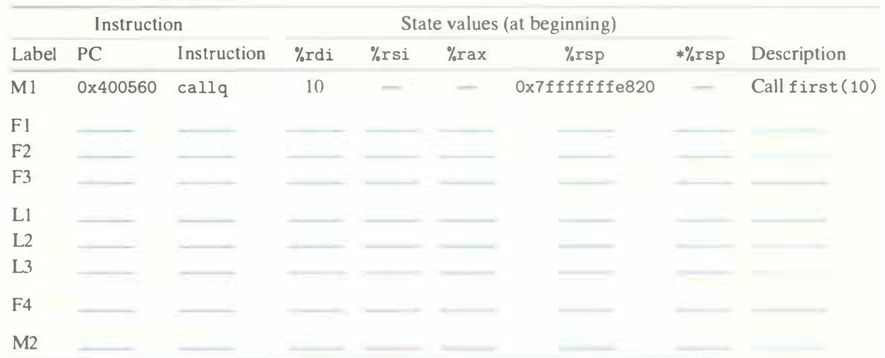

# Practice Problem 3.32 (solution page 339)
The disassembled code for two functions `first` and `last` is shown below, along with the code for a call of `first` by function `main`:

Each of these instructions is given a label, similar to those in Figure 3.27(a). Starting with the calling of `first(10)` by `main`, fill in the following table to trace instruction execution through to the point where the program returns back to `main`.

