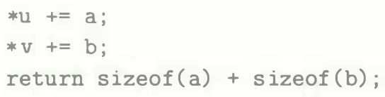
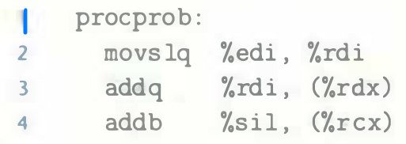

# Practice Problem 3.33 (solution page 339)
A C function `procprob` has four arguments `u`, `a`, `v`, and `b`. Each is either a signed number or a pointer to a signed number, where the numbers have different sizes. The function has the following body:

It compiles to the following x86-64 code:

Determine a valid ordering and types of the four parameters. There are two
correct answers.