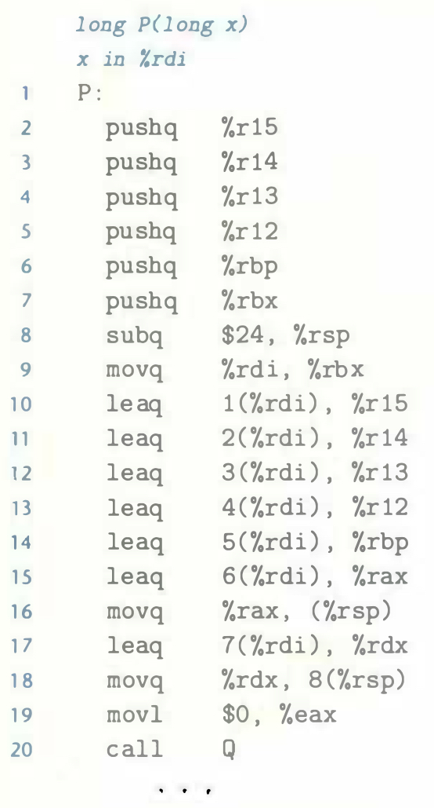

# Practice Problem 3.34 (solution page 340)
Consider a function `P`, which generates local values, named `a0`-`a7`. It then calls function `Q`, which has no arguments. `GCC` produces the following code for the first part of `P`:

A. Identify which local values get stored in callee-saved registers.

B. Identify which local values get stored on the stack.

C. Explain why the program could not store all of the local values in callee-saved registers.