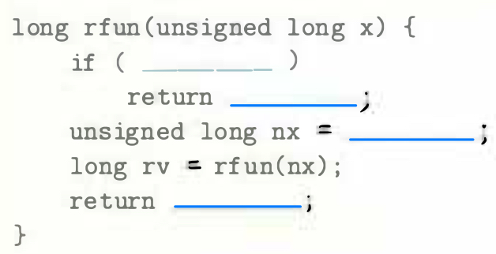
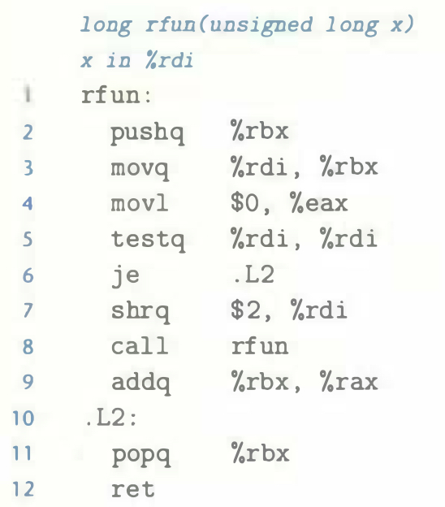

# Practice Problem 3.35 (solution page 340)
For a C function having the general structure

`GCC` generates the following assembly code:

A. What value does `rfun` store in the callee-saved register `%rbx`?

B. Fill in the missing expressions in the C code shown above.