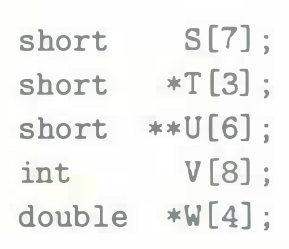
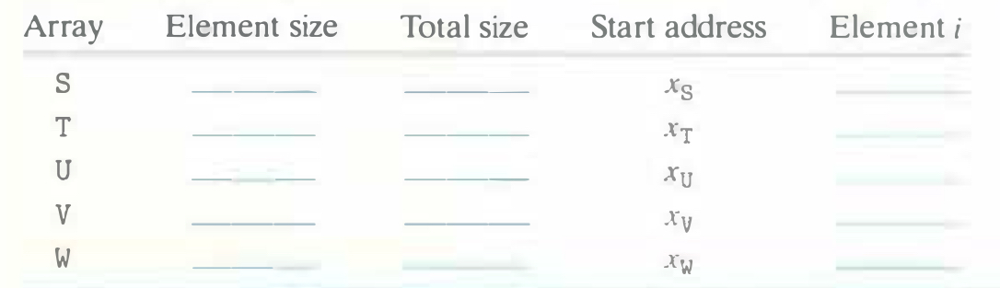

# Practice Problem 3.36 (solution page 341)
Consider the following declarations:

Fill in the following table describing the element size, the total size, and the address of element $i$ for each of these arrays.

