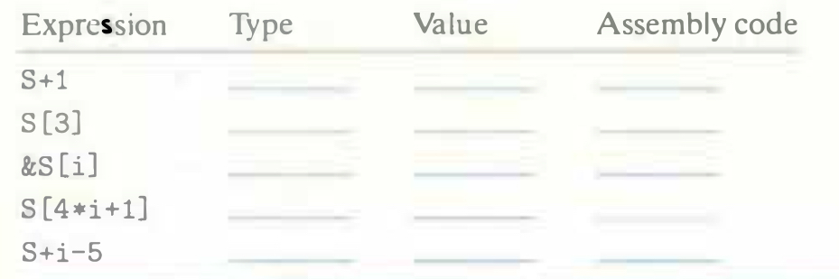

# Practice Problem 3.37 (solution page 341)
Suppose $x_S$, the address of short integer array `S`, and long integer index $i$ are stored in registers `%rdx` and `%rcx`, respectively. For each of the following expressions, give its type, a formula for its value, and an assembly-code implementation. The result should be stored in register `%rax` if it is a pointer and register element `%ax` if it has data type `short`.

