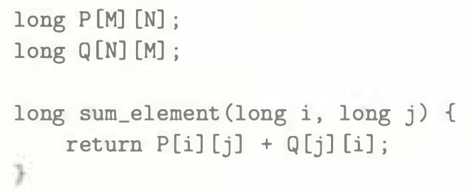
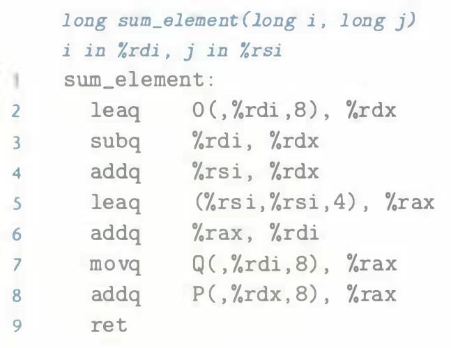

# Practice Problem 3.38 (solution page 341)
Consider the following source code, where `M` and `N` are constants declared with `#define`:

In compiling this program, `GCC` generates the following assembly code:

Use your reverse engineering skills to determine the values of `M` and `N` based on this assembly code.