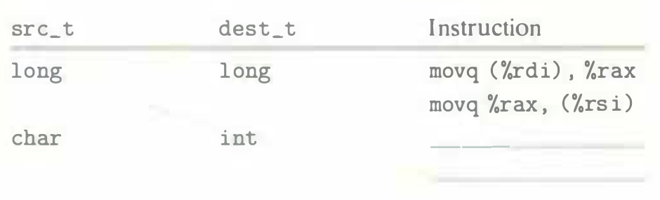

# Practice Problem 3.4 (solution page 326)
Assume variables `sp` and `dp` are declared with types

```c
src_t *sp;
dest_t *dp;
```

where `src_t` and `dest_t` are data types declared with `typedef`. We wish to use the appropriate pair of data movement instructions to implement the operation

```c
*dp = (dest_t) *sp;
```

Assume that the values of `sp` and `dp` are stored in registers `%rdi` and `%rsi`, respectively. For each entry in the table, show the two instructions that implement the specified data movement. The first instruction in the sequence should read from memory, do the appropriate conversion, and set the appropriate portion of register `%rax`. The second instruction should then write the appropriate portion of `%rax` to memory. In both cases, the portions may be `%rax`, `%eax`, `%ax`, or `%al`, and they may differ from one another.

Recall that when performing a cast that involves both a size change and a change of "signedness" in C, the operation should change the size first (Section 2.2.6).




