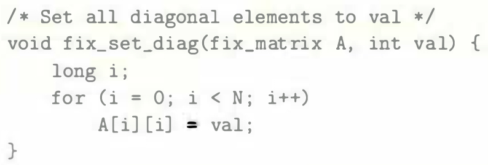
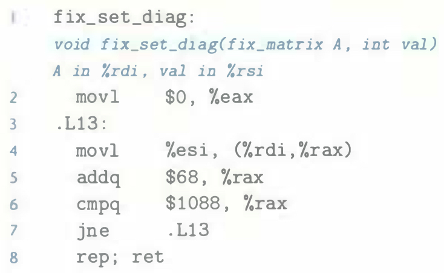

# Practice Problem 3.40 (solution page 342)
The following C code sets the diagonal elements of one of our fixed-size arrays to `val`:

When compiled with optimization level `-O1`, `GCC` generates the following assembly code:

Create a C code program `fix_set_diag_opt` that uses optimizations similar to those in the assembly code, in the same style as the code in Figure 3.37(b). Use expressions involving the parameter $N$ rather than integer constants, so that your code will work correctly if $N$ is redefined.