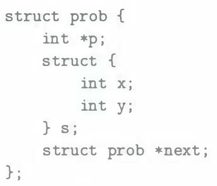
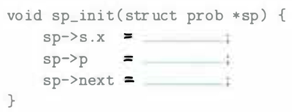
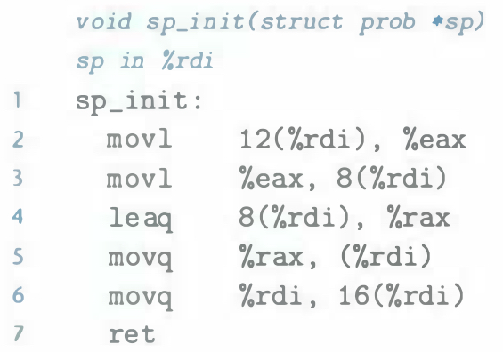

# Practice Problem 3.41 (solution page 343)
Consider the following structure declaration:

This declaration illustrates that one structure can be embedded within another, just as arrays can be embedded within structures and arrays can be embedded within arrays.

The following procedure (with some expressions omitted) operates on this structure:

A. What are the offsets (in bytes) of the following fields?

B. How many total bytes does the structure require?

C. The compiler generates the following assembly code for `sp_init`:

On the basis of this information, fill in the missing expressions in the code for `sp_init`.