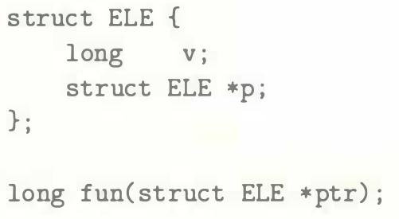
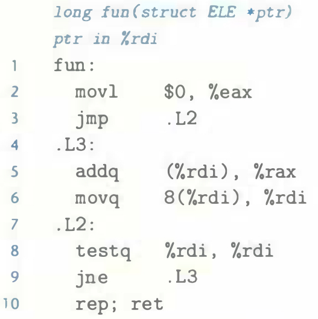

# Practice Problem 3.42 (solution page 343)
The following code shows the declaration of a structure of type `ELE` and the prototype for a function `fun`:

When the code for `fun` is compiled, `GCC` generates the following assembly code:

A. Use your reverse engineering skills to write C code for fun.

B. Describe the data structure that this structure implements and the operation performed by `fun`.