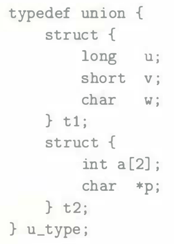
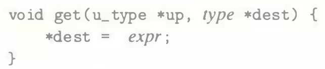
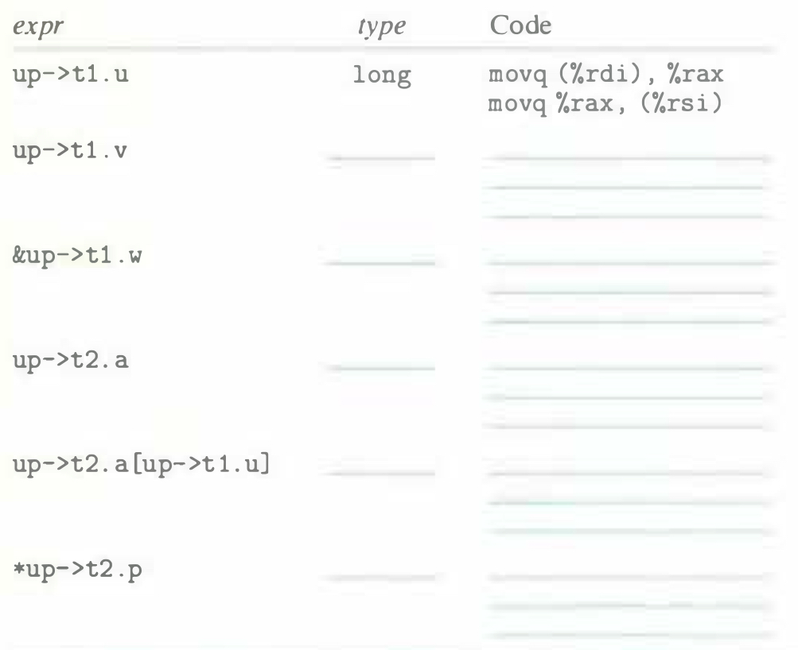

# Practice Problem 3.43 (solution page 344)
Suppose you are given the job of checking that a C compiler generates the proper code for structure and union access. You write the following structure declaration:

You write a series of functions of the form

with different access expressions **expr** and with destination data type **type** set according to type associated with **expr**. You then examine the code generated when compiling the functions to see if they match your expectations.

Suppose in these functions that `up` and `dest` are loaded into registers `%rdi` and `%rsi`, respectively. Fill in the following table with data type **type** and sequences of one to three instructions to compute the expression and store the result at `dest`.

