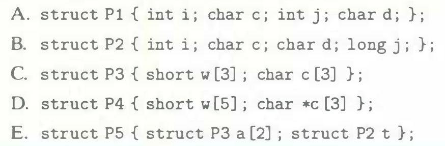

# Practice Problem 3.44 (solution page 345)
For each of the following structure declarations, determine the offset of each field, the total size of the structure, and its alignment requirement for x86-64:

